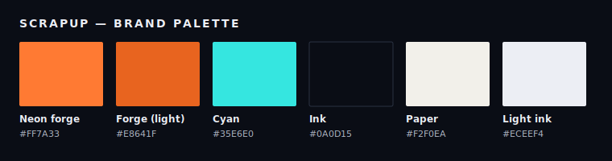

# scrapup-site

The public landing page for [**scrapup.dev**](https://www.scrapup.dev) — a trilingual
(EN / PT / JA) static site built with [Astro](https://astro.build) and deployed on
[Vercel](https://vercel.com). It communicates the scrapup narrative (an AI-assisted Unified
Process — from informational _scrap_ to forged, auditable delivery) and drives visitors to the
[GitHub repository](https://github.com/scrapup/scrapup).

> Developer/build docs are English-only (artifact rule). The **trilingual surface is the landing
> page itself**, not this README.



## Stack

| Concern        | Choice                                                                  |
| -------------- | ----------------------------------------------------------------------- |
| Framework      | Astro (static output, zero/near-zero client JS)                         |
| Hosting / CDN  | Vercel (`@astrojs/vercel`)                                              |
| i18n           | Astro i18n routing + a typed TS dictionary (EN source of truth)         |
| Language entry | On-demand EN root (`/`) auto-detects locale and 307-redirects           |
| SEO            | `BaseLayout` + `Seo.astro` (meta/OG/Twitter/canonical/hreflang/JSON-LD) |
| Sitemap        | `@astrojs/sitemap` (all locales, `www` host)                            |
| Analytics      | Vercel Web Analytics (`@vercel/analytics/astro`, privacy-friendly, no cookies) |
| Tests          | `@playwright/test` (Chromium) + `@axe-core/playwright`                  |
| Versioning     | release-please (`release-type: node`), mirrors `scrapup`                |

## Styling

All visual styles use **scoped `<style>` blocks** in Astro components — no global utility classes or Tailwind.

### Token layers

| File | Purpose |
|------|---------|
| `src/styles/tokens.css` | Design tokens — canonical palette + auxiliary text scale + RGB-triplets |
| `src/styles/base.css` | Reset, `html`/`body`, `::selection`, font-smoothing |
| `src/styles/animations.css` | Keyframes (`scrapupFlicker`, `glC`, `glM`, `glSlice`) + `prefers-reduced-motion` |
| `src/styles/primitives.css` | Shared primitive classes: `.section-title`, `.lede`, `.kicker`, `.btn`, `.card`, `.tag` |
| `src/styles/global.css` | Entry point — imports the four sheets above |

### Naming convention

Components use **BEM-style** class names: `block__element` and `block__element--modifier`.  
The block name matches the component's kebab-case filename (e.g. `TopBar.astro` → `.top-bar`).  
Modifiers go on the same element (`class="block__element block__element--modifier"`).

### No inline styles

The `scripts/no-inline-styles.mjs` guard (zero-dependency Node ESM) scans `src/**/*.astro` for `style="..."` / `style={...}` containing CSS declarations. It runs as part of `npm run check` in `--strict` mode — the build fails if any inline ruleset is present.

**Rule:** add new shared patterns as primitives in `src/styles/primitives.css`; add per-component deltas as scoped BEM rules inside the component's `<style>` block. Never `style=`.

### Visual baselines

Screenshot baselines must be generated on the **CI Playwright container** only — macOS font rendering is non-deterministic and produces different pixel hashes.

```
# Regenerate baselines (CI only):
RUN_VISUAL=1 npm run test:e2e:update -- tests/visual/layout.spec.ts
# Verify against committed baselines:
RUN_VISUAL=1 npm run test:e2e -- tests/visual/layout.spec.ts
```

## Quick start

```bash
nvm use          # honors .nvmrc (Node 24)
npm install
npm run dev      # http://localhost:4321 (HMR)
```

## Scripts

| Script                    | What it does                                                           |
| ------------------------- | ---------------------------------------------------------------------- |
| `npm run dev`             | Local dev server with HMR                                              |
| `npm run build`           | Static production build (Vercel adapter)                               |
| `npm run preview`         | Build with the Node adapter and serve the built output locally\*       |
| `npm run check`           | `astro check` (types) + i18n parity (`scripts/i18n-parity.mjs`)        |
| `npm run format`          | Prettier (`prettier-plugin-astro`)                                     |
| `npm run test:e2e`        | Playwright E2E + SEO + a11y + computed-style against the built preview |
| `npm run test:e2e:update` | Regenerate visual baselines — **CI Playwright container only**         |

\* The Vercel adapter does not support `astro preview`; the `preview` script (and the Playwright
`webServer`) build and serve with the Node adapter (`SSR_ADAPTER=node`) for production parity
without `astro dev`.

## Repository structure

```
src/
  pages/        index.astro (on-demand EN root + detection), pt/index.astro, ja/index.astro, 404.astro
  layouts/      BaseLayout.astro (html lang, fonts, SEO slot)
  components/   Seo.astro, LanguageSwitcher.astro, Landing.astro, sections/*.astro
  i18n/         ui.ts (typed EN/PT/JA dictionary), index.ts (helpers + detection)
  styles/       global.css (brand palette + animations)
scripts/        i18n-parity.mjs (build-time parity guard)
tests/          e2e/* (functional, SEO, a11y), visual/* (computed-style + screenshots)
public/         robots.txt, favicon, social image
brand/          palette.svg, logo system, image assets
docs/           specs/landing-page/{spec,plan,tasks}.md, runbook.md, diagrams/
.github/workflows/  ci.yml, release-please.yml, pr-title.yml
vercel.json     apex→www redirect + security headers (HSTS, CSP, …)
```

## Internationalization

English is the **source of truth**; Portuguese and Japanese mirror its key set exactly. All copy
lives in `src/i18n/ui.ts`. A build-time parity check (`npm run check`) fails, naming the offending
keys, if any locale is missing/extra/empty — so translations cannot silently drift. Clean routes:
`/` (EN), `/pt/`, `/ja/`, with reciprocal `hreflang` + `x-default → EN`.

## SEO & host

Canonical URLs always use the `www.scrapup.dev` host; the apex redirects to it (`vercel.json`).
Every page emits title/description/OG/Twitter/canonical/hreflang and JSON-LD; the sitemap covers
all three locales.

## Deploy & release

- **Every PR** runs checks + build + the Playwright suite (pinned container) and, when Vercel
  secrets are configured, gets a **Vercel preview** (the provisional URL for validation).
- **Production** deploys only when **release-please** cuts a release (the human-sealed Release PR
  is merged) — never on ordinary `main` merges.
- The custom domain is attached **only at cutover**, after validation — see
  [`docs/runbook.md`](docs/runbook.md).

## Specs

This site was built spec-first: see
[`docs/specs/landing-page/spec.md`](docs/specs/landing-page/spec.md),
[`plan.md`](docs/specs/landing-page/plan.md) and
[`tasks.md`](docs/specs/landing-page/tasks.md), plus the operations
[runbook](docs/runbook.md). Contributing conventions are in
[`CONTRIBUTING.md`](CONTRIBUTING.md).

## License

MIT © 2026 scrapup — Marco Antonio Luqueti Faustino.
