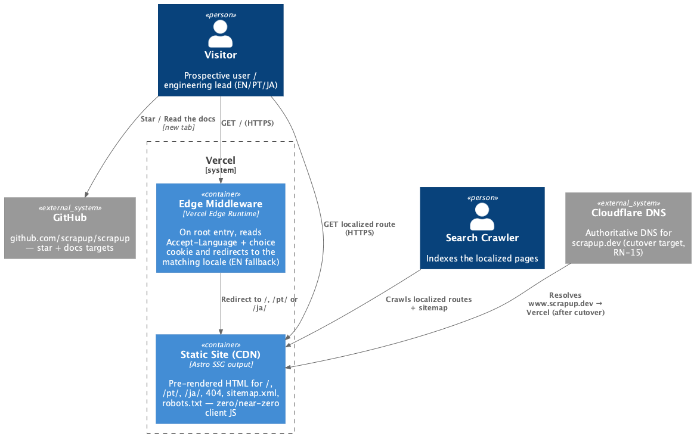
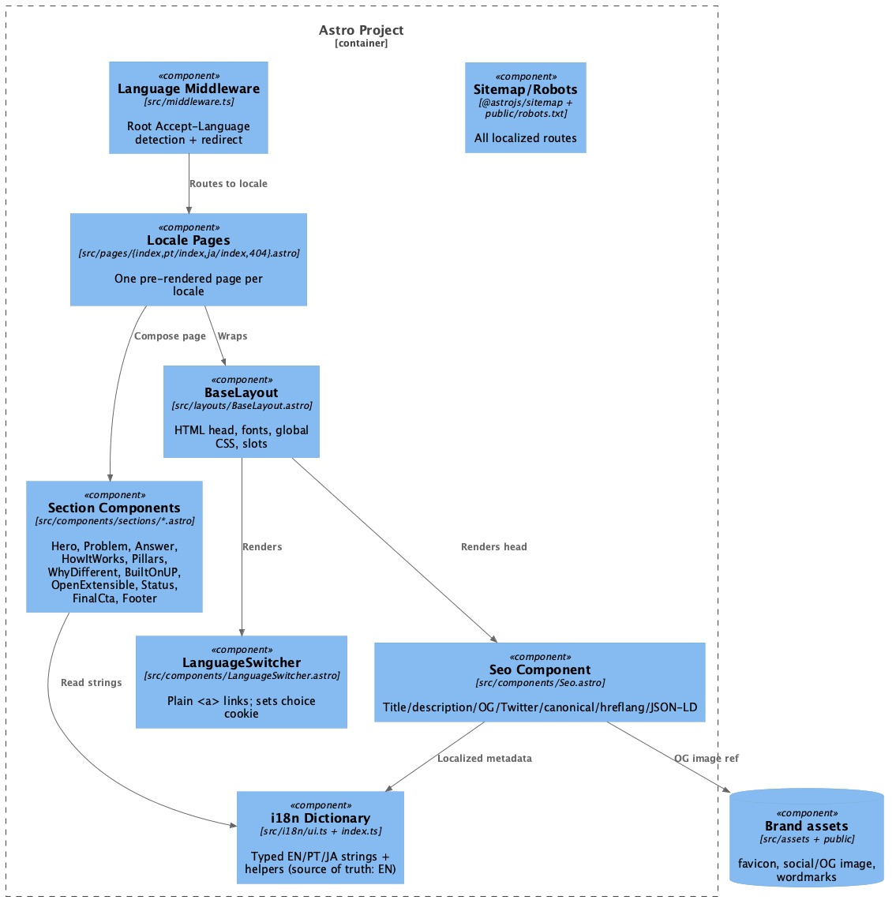
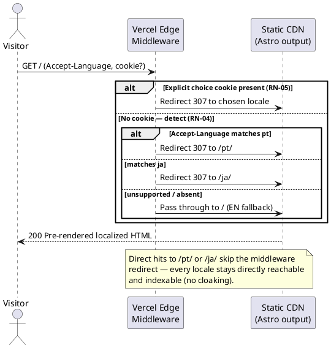

# Technical Plan: scrapup.dev Landing Page

> Phase 2 of Spec-Driven Development — the **how**. Implements `spec.md` (approved).
> Authored in English per the project artifact-language rule (`CLAUDE.md`).
> **Prerequisite:** `spec.md` approved. ✅

## 1. Architecture Overview

- **Main decision:** a **statically pre-rendered Astro site** (SSG) deployed on **Vercel**, with a
  thin **Vercel Edge Middleware** for root-path language auto-detection. No backend, no database,
  no message broker, no personal-data collection (waitlist removed). Content is delivered as static
  HTML from Vercel's CDN; client-side JavaScript is **zero or near-zero**.
- **Why Astro:** zero-JS-by-default static output gives the lightweight/SEO budget of a hand-rolled
  static site **today**, while content collections + SSG absorb the planned multi-page catalog
  **tomorrow** without re-platforming (RN-13). Native i18n routing serves the `/`, `/pt/`, `/ja/`
  clean routes (RN-01).
- **Internationalization:** three pre-rendered locales — English at `/` (source of truth), Portuguese
  at `/pt/`, Japanese at `/ja/` — built from a single typed i18n dictionary so translations cannot
  silently drift (RN-02). Reciprocal `hreflang` + `x-default → EN` on every page (RN-03).
- **Language auto-detection (RN-04/05):** Edge Middleware inspects the `Accept-Language` header (and
  an explicit-choice cookie) on root entry and issues a redirect to the matching locale, falling
  back to English. All locale routes remain directly reachable and indexable (no cloaking).
- **Versioning/release:** **release-please**, mirroring the `scrapup` repo (config + manifest +
  `release-please.yml` + `pr-title.yml`). Human-sealed Release PR cuts the version/CHANGELOG/tag.
- **Publication:** **GitHub Actions**, mirroring `scrapup`'s release flow — a **Vercel preview**
  deploy per PR (the **provisional URL** for validation), and the **production deploy gated on
  release-please** (runs only when a release is created, i.e. the Release PR is merged — the same
  way `scrapup` runs `npm publish` on `release_created`). The production custom domain is attached
  **only at cutover** (RN-15), independent of the deploy pipeline.
- **Repository affected:** `scrapup-site` (this repo).

### 1.1 Technology Choices

| Concern            | Choice                                                                                            | Note                                                                                                                                                                                        |
| ------------------ | ------------------------------------------------------------------------------------------------- | ------------------------------------------------------------------------------------------------------------------------------------------------------------------------------------------- |
| Framework          | Astro (static output)                                                                             | Zero-JS default; `astro check` for type safety                                                                                                                                              |
| Hosting / CDN      | Vercel                                                                                            | `@astrojs/vercel` adapter                                                                                                                                                                   |
| Edge logic         | Vercel Edge Middleware (`src/middleware.ts`)                                                      | Root language redirect only                                                                                                                                                                 |
| i18n               | Astro i18n routing + typed TS dictionaries                                                        | Build-time parity check                                                                                                                                                                     |
| Fonts              | **Google Fonts CDN** (Space Grotesk, IBM Plex Mono/Sans, Noto Sans JP) — exactly as the prototype | Keep the prototype's `fonts.googleapis.com` `<link>` verbatim; CSP must allow `fonts.googleapis.com` (styles) and `fonts.gstatic.com` (font files) with `<link rel="preconnect">` retained. |
| Sitemap            | `@astrojs/sitemap`                                                                                | Covers all localized routes                                                                                                                                                                 |
| SEO                | `BaseLayout` + `Seo.astro` component                                                              | Meta/OG/Twitter/canonical/hreflang/JSON-LD                                                                                                                                                  |
| Versioning         | release-please (`release-type: node`)                                                             | Mirrors `scrapup`                                                                                                                                                                           |
| CI/CD              | GitHub Actions + Vercel CLI                                                                       | Preview + production deploys                                                                                                                                                                |
| Accent token       | Fixed `--neon: #FF7A33` (orange)                                                                  | Prototype default; full brand palette from `brand/scrapup - Logo System.dc.html` (§3.3)                                                                                                     |
| E2E / visual tests | `@playwright/test` (Chromium) + `@axe-core/playwright`                                            | Runs against the built `preview` output; computed-style asserts + screenshot regression with flakiness controls (§5.4)                                                                      |

## 2. Solution Diagrams

### 2.1 C4 — Level 2 (Containers)

```plantuml
@startuml C4_Container_scrapup_site
!include https://raw.githubusercontent.com/plantuml-stdlib/C4-PlantUML/master/C4_Container.puml

Person(visitor, "Visitor", "Prospective user / engineering lead (EN/PT/JA)")
Person(crawler, "Search Crawler", "Indexes the localized pages")

System_Boundary(vercel, "Vercel") {
    Container(edge, "Edge Middleware", "Vercel Edge Runtime", "On root entry, reads Accept-Language + choice cookie and redirects to the matching locale (EN fallback)")
    Container(cdn, "Static Site (CDN)", "Astro SSG output", "Pre-rendered HTML for /, /pt/, /ja/, 404, sitemap.xml, robots.txt — zero/near-zero client JS")
}

System_Ext(github, "GitHub", "github.com/scrapup/scrapup — star + docs targets")
System_Ext(cloudflare, "Cloudflare DNS", "Authoritative DNS for scrapup.dev (cutover target, RN-15)")

Rel(visitor, edge, "GET / (HTTPS)")
Rel(edge, cdn, "Redirect to /, /pt/ or /ja/")
Rel(visitor, cdn, "GET localized route (HTTPS)")
Rel(crawler, cdn, "Crawls localized routes + sitemap")
Rel(visitor, github, "Star / Read the docs", "new tab")
Rel(cloudflare, cdn, "Resolves www.scrapup.dev → Vercel (after cutover)")
@enduml
```



> Rendered from [`docs/diagrams/c4-container.puml`](../../diagrams/c4-container.puml).

### 2.2 C4 — Level 3 (Components, inside the Astro build)

```plantuml
@startuml C4_Component_scrapup_site
!include https://raw.githubusercontent.com/plantuml-stdlib/C4-PlantUML/master/C4_Component.puml

Container_Boundary(astro, "Astro Project") {
    Component(mw, "Language Middleware", "src/middleware.ts", "Root Accept-Language detection + redirect")
    Component(pages, "Locale Pages", "src/pages/{index,pt/index,ja/index,404}.astro", "One pre-rendered page per locale")
    Component(layout, "BaseLayout", "src/layouts/BaseLayout.astro", "HTML head, fonts, global CSS, slots")
    Component(seo, "Seo Component", "src/components/Seo.astro", "Title/description/OG/Twitter/canonical/hreflang/JSON-LD")
    Component(sections, "Section Components", "src/components/sections/*.astro", "Hero, Problem, Answer, HowItWorks, Pillars, WhyDifferent, BuiltOnUP, OpenExtensible, Status, FinalCta, Footer")
    Component(switcher, "LanguageSwitcher", "src/components/LanguageSwitcher.astro", "Plain <a> links; sets choice cookie")
    Component(i18n, "i18n Dictionary", "src/i18n/ui.ts + index.ts", "Typed EN/PT/JA strings + helpers (source of truth: EN)")
    Component(sitemap, "Sitemap/Robots", "@astrojs/sitemap + public/robots.txt", "All localized routes")
}

ComponentDb(brand, "Brand assets", "src/assets + public", "favicon, social/OG image, wordmarks")

Rel(mw, pages, "Routes to locale")
Rel(pages, layout, "Wraps")
Rel(layout, seo, "Renders head")
Rel(pages, sections, "Compose page")
Rel(sections, i18n, "Read strings")
Rel(seo, i18n, "Localized metadata")
Rel(layout, switcher, "Renders")
Rel(seo, brand, "OG image ref")
@enduml
```



> Rendered from [`docs/diagrams/c4-component.puml`](../../diagrams/c4-component.puml).

### 2.3 Sequence — Root language auto-detection (success + fallback)




> Rendered from [`docs/diagrams/sequence-language-detection.puml`](../../diagrams/sequence-language-detection.puml).

## 3. Content & i18n Data Model

No database. The "data" of this site is the **trilingual copy**, extracted verbatim from the
prototypes in `design-project/` and modeled as a typed dictionary.

### 3.1 i18n Dictionary (`src/i18n/ui.ts`)

| Aspect                        | Definition                                                                                                                                                       |
| ----------------------------- | ---------------------------------------------------------------------------------------------------------------------------------------------------------------- |
| Shape                         | `Record<Lang, Record<Key, string>>` where `Lang = 'en' \| 'pt' \| 'ja'`                                                                                          |
| Source of truth               | `en` — `pt`/`ja` keys must match the `en` key set exactly (RN-02)                                                                                                |
| Keys                          | One per copy fragment, grouped by section (e.g. `hero.headline`, `problem.stat1.value`, `nav.star`, `cta.docs`, `notFound.title`)                                |
| Parity check                  | A build-time script asserts every locale has the full `en` key set; a missing/extra key fails the build (supports RN-02/14, the "missing translation" edge case) |
| Helpers (`src/i18n/index.ts`) | `getLangFromUrl(url)`, `useTranslations(lang)`, `LOCALES`, `DEFAULT_LOCALE='en'`                                                                                 |

### 3.2 Per-locale SEO metadata

| Field            | Source                     | Example (EN)                                                   |
| ---------------- | -------------------------- | -------------------------------------------------------------- |
| `title`          | i18n `meta.title`          | `scrapup — AI-assisted Unified Process for engineering teams`  |
| `description`    | i18n `meta.description`    | From brief §1 positioning statement                            |
| `og:image`       | `brand/scrapup-social.png` | Absolute `https://www.scrapup.dev/...` URL                     |
| `canonical`      | computed                   | `https://www.scrapup.dev/` · `/pt/` · `/ja/` (www host, RN-10) |
| `hreflang`       | computed                   | `en`→`/`, `pt`→`/pt/`, `ja`→`/ja/`, `x-default`→`/`            |
| `lang` attr      | route                      | `<html lang="en                                                | pt  | ja">` |
| keywords/JSON-LD | brief §12                  | `Organization` + `WebSite` + `SoftwareApplication` schema      |

### 3.3 Design Tokens (Brand Palette)

Canonical palette — **source of truth: `brand/scrapup - Logo System.dc.html` (block F9 · PALETTE)**.
Defined as CSS custom properties in `src/styles/global.css` and asserted in tests (TF-53-04).

| Token          | Hex       | Name (Logo System) | Use                                                    |
| -------------- | --------- | ------------------ | ------------------------------------------------------ |
| `--neon`       | `#FF7A33` | Neon forge         | Accent on dark (the flickering "up", CTAs, highlights) |
| `--neon-light` | `#E8641F` | Forge (light)      | Accent on light/paper backgrounds                      |
| `--cy`         | `#35E6E0` | Cyan               | Secondary accent (section labels, links)               |
| `--ink`        | `#0A0D15` | Ink                | Primary background                                     |
| `--paper`      | `#F2F0EA` | Paper              | Light / inverse background                             |
| `--light-ink`  | `#ECEEF4` | Light ink          | Foreground text on ink                                 |

Secondary text greys carried over from the prototype (e.g. `#AEB4C2`, `#8A90A0`, `#7E8597`,
`#C7CCD8`) and the deep-footer ink `#07090E` are shades, not core palette — keep them as literals or
auxiliary tokens, but the six above are the brand-canonical set.

## 4. Integration Contracts

### 4.1 Edge Middleware (`src/middleware.ts`)

| Property   | Value                                                                                                                       |
| ---------- | --------------------------------------------------------------------------------------------------------------------------- |
| Trigger    | Request to `/` (root) only                                                                                                  |
| Inputs     | `Accept-Language` header; `scrapup_lang` cookie (explicit choice)                                                           |
| Output     | `307` redirect to `/pt/` or `/ja/`; or pass-through to `/` (EN)                                                             |
| Invariants | Never blocks direct `/pt/`, `/ja/` hits; never redirects crawlers away from a requested locale; fail-safe → EN on any error |

### 4.2 Static SEO surfaces

- `sitemap-index.xml` / `sitemap-*.xml` via `@astrojs/sitemap` — all three locales, `www` host.
- `public/robots.txt` — `Allow: /`, points to the sitemap, no disallowed paths.
- `<link rel="alternate" hreflang="…">` set on every page incl. `x-default`.
- JSON-LD `<script type="application/ld+json">` — `Organization` (scrapup, logo, sameAs GitHub),
  `WebSite`, `SoftwareApplication` (applicationCategory: DeveloperApplication, license: MIT).

### 4.3 `vercel.json` (host + headers)

| Concern            | Rule                                                                                                                                                                                                                                                                                                                                                                                     |
| ------------------ | ---------------------------------------------------------------------------------------------------------------------------------------------------------------------------------------------------------------------------------------------------------------------------------------------------------------------------------------------------------------------------------------- |
| Apex → www (RN-10) | Redirect `scrapup.dev` → `https://www.scrapup.dev` (301)                                                                                                                                                                                                                                                                                                                                 |
| Security headers   | `Strict-Transport-Security` (HSTS, `.dev` preloaded), `X-Content-Type-Options: nosniff`, `Referrer-Policy: strict-origin-when-cross-origin`, a `Content-Security-Policy` allowing self + inline styles + the Google Fonts origins (`style-src 'self' 'unsafe-inline' https://fonts.googleapis.com`; `font-src 'self' https://fonts.gstatic.com`) — matching the prototype's font loading |
| 404                | Astro `src/pages/404.astro` served with HTTP 404                                                                                                                                                                                                                                                                                                                                         |

### 4.4 GitHub Actions (publication)

| Workflow             | Trigger          | Responsibility                                                                                                                                                                                                                                                      |
| -------------------- | ---------------- | ------------------------------------------------------------------------------------------------------------------------------------------------------------------------------------------------------------------------------------------------------------------- |
| `ci.yml`             | `pull_request`   | Install, `astro check` + i18n parity + build; run **Playwright E2E + visual + a11y** against the built `preview` (on the official Playwright container, §5.4); then deploy a **Vercel preview** → comment the provisional URL for validation                        |
| `release-please.yml` | `push` to `main` | Open/maintain the Release PR; **on `release_created`** (Release PR merged): checkout, build, and deploy **Vercel production** (`vercel --prod`) using `VERCEL_TOKEN`/`VERCEL_ORG_ID`/`VERCEL_PROJECT_ID` — the same gated pattern as `scrapup`'s `npm publish` step |
| `pr-title.yml`       | `pull_request`   | Enforce Conventional Commit PR title (mirrors `scrapup`)                                                                                                                                                                                                            |

> The production deploy fires **only when release-please cuts a release** (human-sealed Release PR
> merge) — there is no deploy on ordinary `main` merges. Production deploys land on the Vercel
> project's URL; the **custom domain stays detached until the manual cutover** (RN-15). Validation
> happens on the PR preview / Vercel production URL first; only then does the Cloudflare DNS point
> at Vercel.

### 4.5 release-please configuration

Mirror `scrapup` with site-appropriate `extra-files` (none of the plugin manifests apply):

```json
{
  "$schema": "https://raw.githubusercontent.com/googleapis/release-please/main/schemas/config.json",
  "include-component-in-tag": false,
  "packages": {
    ".": {
      "release-type": "node",
      "bump-minor-pre-major": true,
      "bump-patch-for-minor-pre-major": false,
      "changelog-path": "CHANGELOG.md"
    }
  }
}
```

Manifest `.release-please-manifest.json`: `{ ".": "0.1.0" }`.

## 5. Resilience, Security and Error Handling

### 5.1 Failure Matrix

| Component           | Failure              | Strategy                                                                   | User Impact                                   |
| ------------------- | -------------------- | -------------------------------------------------------------------------- | --------------------------------------------- |
| Edge Middleware     | Error / cold edge    | Fail-safe pass-through to `/` (EN)                                         | Sees English; no broken page (RN-04 fallback) |
| Self-hosted font    | Missing/blocked      | CSS font stack falls back to `system-ui` / `Noto Sans JP` already declared | Minor visual change only                      |
| Static asset (CDN)  | 404 on a path        | Branded localized `404.astro` with HTTP 404                                | Clear recovery path home                      |
| Apex / HTTP request | Wrong host or scheme | `vercel.json` 301 → `https://www.scrapup.dev`                              | Transparent redirect                          |
| Deploy pipeline     | Build/check fails    | CI red; nothing ships; domain untouched                                    | None (last good deploy stays)                 |

### 5.2 Security

- No secrets in client bundles (none exist; no API keys after waitlist removal).
- CI/CD secrets (`VERCEL_TOKEN`, `VERCEL_ORG_ID`, `VERCEL_PROJECT_ID`) live only in GitHub Actions
  secrets; documented in the runbook.
- TLS mandatory (`.dev` HSTS preload); Vercel issues/serves the certificate; Cloudflare record set to
  **"DNS only"** (no orange-cloud proxy) to avoid double-CDN/TLS conflicts.
- Security headers per §4.3; CSP allows the Google Fonts origins only (`fonts.googleapis.com`,
  `fonts.gstatic.com`), matching the prototype — no other third-party origins.
- `Star on GitHub` is a plain outbound link with `rel="noopener"` — never claims to star on the
  visitor's behalf (RN-06).

### 5.3 Observability

| Type        | Signal                                                     | Purpose                                         |
| ----------- | ---------------------------------------------------------- | ----------------------------------------------- |
| Build check | i18n parity script result                                  | Block ship on missing/stale translation (RN-02) |
| Build check | `astro check` (types) + Lighthouse budget (optional in CI) | Enforce SEO/perf SLAs (§5 spec)                 |
| Runtime     | Vercel deployment + edge logs                              | Diagnose redirects/deploys                      |
| Deferred    | Privacy-respecting analytics (L4)                          | Not built; not precluded (RN-13)                |

### 5.4 End-to-end & visual testing (flakiness controls)

Tests run with **`@playwright/test`** (single **Chromium** project) plus **`@axe-core/playwright`**,
executed against the **built** site (`astro build && astro preview`) for production parity — never
against `astro dev`. Two assertion layers, ordered by robustness:

1. **Computed-style / DOM assertions (primary, deterministic):** colors and tokens via
   `getComputedStyle` (e.g. `--neon` resolves to `#FF7A33`, `body` background `#0A0D15`, CTA accent,
   applied `font-family`), plus SEO (`canonical` on the `www` host, four `hreflang`+`x-default`,
   parseable JSON-LD) and a11y (axe-core: no critical violations). These do not rely on pixels.
2. **Screenshot regression (secondary):** `toHaveScreenshot()` for overall layout, gated by the
   controls below so it does not flake.

| Caveat (source of flakiness)                                | Control applied                                                                                                                                                             |
| ----------------------------------------------------------- | --------------------------------------------------------------------------------------------------------------------------------------------------------------------------- |
| Google Fonts load is async (CDN)                            | `await document.fonts.ready` + `waitForLoadState('networkidle')` before any snapshot or style assertion                                                                     |
| CSS animations (`scrapupFlicker`, glitch `glC/glM/glSlice`) | global `use.reducedMotion: 'reduce'` + inject CSS killing `animation`/`transition`/`caret`; `toHaveScreenshot({ animations: 'disabled' })`                                  |
| OS/runner font-rendering differences                        | baselines are generated **and** compared **only** on the official Playwright container (`mcr.microsoft.com/playwright:vX.Y.Z`) in CI — never commit local-machine baselines |
| Pixel-diff brittleness                                      | prefer the computed-style layer for colors; screenshots use a `maxDiffPixelRatio` threshold and `mask` the animated/dynamic regions                                         |
| Browser/engine drift                                        | pin the Playwright version and its bundled browsers; one Chromium project; fixed `viewport` + `deviceScaleFactor`                                                           |
| Server not ready                                            | `webServer` waits for the preview URL before the suite starts (`reuseExistingServer: !CI`)                                                                                  |
| Transient timing                                            | `retries: 2` in CI; `trace`/`screenshot` captured on retry for diagnosis                                                                                                    |

The baseline screenshots are committed; updating them is a deliberate, CI-runner-only step
(documented in the runbook/README), so a developer never overwrites the Linux baseline from macOS.

## 6. Developer Experience (run & edit locally)

The site must be runnable and editable locally (user requirement). `package.json` scripts:

| Script            | Command                                        | Purpose                                              |
| ----------------- | ---------------------------------------------- | ---------------------------------------------------- |
| `dev`             | `astro dev`                                    | Local dev server with HMR at `localhost:4321`        |
| `build`           | `astro build`                                  | Produce the static production output                 |
| `preview`         | `astro preview`                                | Serve the built output locally                       |
| `check`           | `astro check && node scripts/i18n-parity.mjs`  | Type + translation-parity validation                 |
| `format`          | `prettier -w .` (with `prettier-plugin-astro`) | Consistent formatting                                |
| `test:e2e`        | `playwright test`                              | E2E + visual + a11y against the built preview (§5.4) |
| `test:e2e:update` | `playwright test --update-snapshots`           | Regenerate visual baselines (CI-runner only)         |

**Editing model:** copy lives in `src/i18n/ui.ts` (EN source of truth → PT/JA); layout/structure in
`src/components/sections/*.astro`; visual tokens in `src/styles/global.css`. A Node version is pinned
(`.nvmrc`) and `README` documents `npm install → npm run dev`.

### 6.1 Proposed Repository Structure

```
scrapup-site/
  astro.config.mjs            # integrations: vercel adapter, sitemap, i18n
  vercel.json                 # apex→www redirect, security headers
  package.json / tsconfig.json / .nvmrc
  release-please-config.json / .release-please-manifest.json
  src/
    middleware.ts             # root language auto-detection
    i18n/ ui.ts, index.ts     # typed trilingual dictionary + helpers
    layouts/ BaseLayout.astro
    components/ Seo.astro, LanguageSwitcher.astro, sections/*.astro
    pages/ index.astro, pt/index.astro, ja/index.astro, 404.astro
    styles/ global.css
    assets/ (brand, self-hosted fonts)
  public/ robots.txt, favicon, social image
  scripts/ i18n-parity.mjs
  playwright.config.ts          # webServer=preview, chromium, reducedMotion, thresholds
  tests/e2e/                    # functional + SEO + a11y specs
  tests/visual/                 # screenshot regression + __screenshots__ baselines
  docs/
    specs/landing-page/{spec,plan,tasks}.md
    runbook.md                # external setup + domain cutover (RN-15)
  .github/workflows/ ci.yml, release-please.yml, pr-title.yml
```

## 7. Justification & Trade-offs

| Decision                                   | Rejected alternative                                  | Justification                                                                                                                                                                            |
| ------------------------------------------ | ----------------------------------------------------- | ---------------------------------------------------------------------------------------------------------------------------------------------------------------------------------------- |
| Astro (SSG)                                | Next.js / hand-rolled static                          | Zero-JS landing today + content-collection catalog tomorrow; static is lighter but can't absorb the catalog without becoming a hand-built SSG                                            |
| Google Fonts CDN (match prototype)         | Self-hosting fonts                                    | Architect decision: the build must match the prototype exactly; CSP is scoped to the two Google Fonts origins                                                                            |
| release-please-gated production deploy     | Deploy on every `main` merge / Vercel Git integration | Architect decision: mirror `scrapup` — publication fires on `release_created` (human-sealed Release PR), keeping the publish gate identical across the org                               |
| Domain attached only at cutover            | Point DNS during build-out                            | RN-15 — validate on the provisional URL before the live domain switches                                                                                                                  |
| Cloudflare "DNS only" → Vercel             | Cloudflare orange-cloud proxy over Vercel             | Avoids double-CDN/TLS conflict on an HSTS-preloaded `.dev` domain                                                                                                                        |
| Typed TS i18n dictionary                   | Astro content collections for copy                    | Simpler + compile-time parity for landing copy now; content collections reserved for the future catalog (RN-13)                                                                          |
| release-please (mirror `scrapup`)          | Manual versioning                                     | Consistency across the org; human-sealed Release PR gate                                                                                                                                 |
| Computed-style asserts + gated screenshots | Pixel-diff-only visual tests                          | Color/token checks are deterministic via `getComputedStyle`; screenshots add layout coverage but only under fonts-ready + animations-off + CI-runner baselines to avoid flakiness (§5.4) |

## 8. Resolved Architect Decisions

1. **Fonts:** Google Fonts CDN, **exactly as the prototype** (no self-hosting). CSP scoped to the
   two Google Fonts origins.
2. **Accent token:** fixed `--neon: #FF7A33` (prototype default).
3. **Production deploy trigger:** **release-please-gated** — production deploy runs on
   `release_created` only, mirroring `scrapup`. No deploy on ordinary `main` merges.
