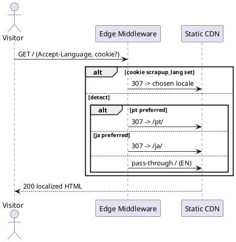
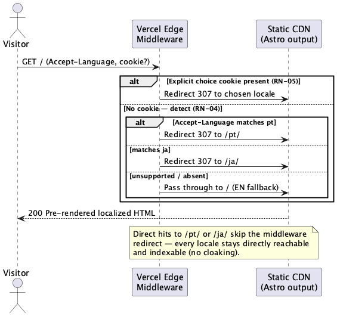
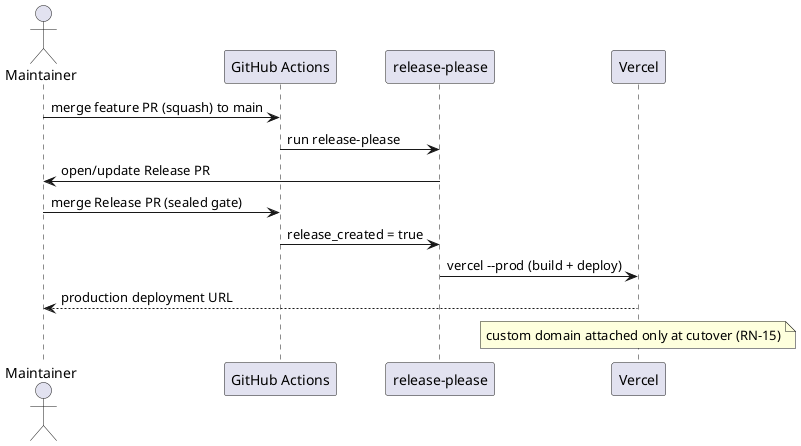
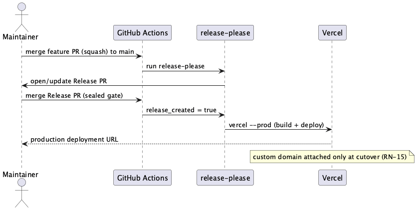

# Execution Backlog: scrapup.dev Landing Page

> Phase 3 of Spec-Driven Development — atomic execution backlog. Implements `plan.md` (approved).
> Authored in English per the project artifact-language rule (`CLAUDE.md`).
> **Prerequisites:** `spec.md` + `plan.md` approved. ✅

## Reference Epic

**Epic:** E-LANDING — scrapup.dev public landing page (internal initiative; no PM-issued ClickUp epic).
**System:** `scrapup-site`

---

## Traceability

| Requirement (spec.md)                         | Architectural decision (plan.md)                          | User Story   | Tasks                    |
| --------------------------------------------- | --------------------------------------------------------- | ------------ | ------------------------ |
| RN-01, RN-02                                  | Astro i18n routes + typed dictionary (§1, §3)             | US-46, US-47 | TF-46-01/02/03, TF-47-03 |
| RN-03                                         | hreflang + x-default (§4.2)                               | US-48        | TF-48-01                 |
| RN-04, RN-05                                  | Edge middleware auto-detection (§2.3, §4.1)               | US-49        | TF-49-01                 |
| RN-06                                         | Star = plain outbound link (§5.2)                         | US-47        | TF-47-01                 |
| RN-07, RN-08                                  | Static SSG, fonts as prototype (§1.1)                     | US-45, US-47 | TF-45-03, TF-47-01       |
| RN-09, RN-10                                  | TLS + apex→www + canonical (§4.3)                         | US-48        | TF-48-01, TF-48-04       |
| RN-11                                         | No data collection / scoped CSP (§5.2)                    | US-48        | TF-48-04                 |
| RN-12                                         | No live star count (copy port)                            | US-47        | TF-47-01                 |
| RN-13                                         | Astro foundation, catalog-ready (§1)                      | US-45        | TF-45-01                 |
| RN-14                                         | Trilingual incl. 404 + parity check (§3.1)                | US-46, US-50 | TF-46-03, TF-50-01       |
| RN-15                                         | Cutover gated on validation (§4.4)                        | US-51, US-52 | TF-51-04, TF-52-02       |
| Perf/SEO SLAs (§5 spec)                       | Zero-JS SSG + sitemap/robots (§4.2)                       | US-48        | TF-48-03                 |
| RN-04/05, RN-03/06/12/14, a11y/visual SLAs    | Playwright E2E + visual + a11y, flakiness controls (§5.4) | US-53        | TF-53-01..05             |
| Brand palette (§3.3), dev/release conventions | README + palette image + CONTRIBUTING                     | US-54        | TF-54-01..03             |

---

## User Stories Overview

| #     | User Story                                | Value Delivered                                                                      | Pts | Priority |
| ----- | ----------------------------------------- | ------------------------------------------------------------------------------------ | --- | -------- |
| US-45 | Project foundation & developer experience | Developers can run, edit and build the site locally                                  | 3   | P0       |
| US-46 | Trilingual i18n system                    | Copy exists in EN/PT/JA with build-time parity enforcement                           | 3   | P0       |
| US-47 | Landing page port (trilingual)            | The landing renders, matching the prototype, in three languages                      | 5   | P1       |
| US-48 | SEO & metadata surfaces                   | Pages are fully indexable and correctly cross-linked                                 | 3   | P1       |
| US-49 | Language auto-detection                   | Visitors land in their language automatically (EN fallback)                          | 3   | P1       |
| US-50 | Branded 404 page                          | Non-existent paths return a branded localized 404                                    | 2   | P2       |
| US-51 | Release & publication pipeline            | Merges preview-deploy; releases publish to Vercel (release-please)                   | 5   | P1       |
| US-52 | Operations runbook                        | The operator can configure externals and cut over the domain safely                  | 2   | P1       |
| US-53 | E2E & visual validation (Playwright)      | Behavior, SEO, a11y, colors and layout are regression-tested with flakiness controls | 5   | P1       |
| US-54 | Repository documentation                  | Contributors get a README (with a palette image) and a contribution guide            | 2   | P2       |

**Topological order:** US-45 → US-46 → US-47 → US-48 → US-49 → US-50 → US-51 → US-52.
**US-53** depends on the testable surface (US-47 pages, US-48 SEO, US-49 detection, US-50 404) and
wires into US-51's `ci.yml`; run it after those land (parallelizable with US-52).
**US-54** (docs) only needs the project to exist (US-45) and the palette (§3.3); parallelizable
with any US after US-45.
Diagrams reused from `plan.md` §2 (C4 N2 containers, C4 N3 components); per-US sequence diagrams
added only where a non-trivial flow exists (US-49 detection, US-51 deploy).

---

## US-45: Project foundation & developer experience

**Epic:** E-LANDING · **System:** `scrapup-site` · **Estimativa:** 3 SP · **Prioridade:** P0

### Narrativa de Valor

> **Eu como** desenvolvedor do scrapup-site,
> **Eu quero** um projeto Astro configurado com scripts de desenvolvimento,
> **Para que** eu possa rodar, editar e buildar a landing localmente e publicá-la no Vercel.

### Contexto de Negócio

The prototype is a non-servable Claude Design runtime file. This US establishes the Astro project,
the Vercel adapter, and the local dev workflow so every later US has a runnable foundation, and the
site is catalog-ready (RN-13).

### Critérios de Aceitação (Negócio)

- [ ] `npm install && npm run dev` serves the project locally.
- [ ] `npm run build` produces a static Vercel-targeted output.
- [ ] Design tokens (colors, accent `#FF7A33`, cyan `#35E6E0`, fonts, flicker animation) match the prototype.

### Regras de Negócio Aplicáveis

| #     | Regra                      | Tipo        |
| ----- | -------------------------- | ----------- |
| RN-08 | Zero/near-zero client JS   | Restritiva  |
| RN-13 | Architecture catalog-ready | Obrigatória |

### Sequenciamento de Tarefas

| #        | Tarefa                                        | Escopo         | Depende de |
| -------- | --------------------------------------------- | -------------- | ---------- |
| TF-45-01 | Scaffold Astro + Vercel adapter + base config | Build/infra    | —          |
| TF-45-02 | Dev scripts + formatting                      | Dev tooling    | TF-45-01   |
| TF-45-03 | Design tokens, fonts & BaseLayout shell       | Styling/layout | TF-45-01   |

### Tarefas

#### TF-45-01: [scrapup-site] Scaffold Astro project with Vercel adapter and base config

**User Story:** US-45 · **Prioridade:** P0

##### 1. Descrição e Objetivo

> **Eu como** desenvolvedor, **Eu quero** o projeto Astro inicial com adapter Vercel, **Para que** exista uma base buildável e deployável.

_Contexto Arquitetural:_ Astro static output (`output: 'static'`) with `@astrojs/vercel` adapter; i18n + sitemap integrations wired (configured in later TFs).

##### 2. Especificação Técnica

**2.1 Pontos de Interceptação**

- `package.json` — deps: `astro`, `@astrojs/vercel`, `@astrojs/sitemap`, `typescript`.
- `astro.config.mjs` — adapter Vercel, `site: 'https://www.scrapup.dev'`, `output: 'static'`, integrations placeholder.
- `tsconfig.json` — extends `astro/tsconfigs/strict`.
- `.nvmrc` — pin Node 20.
- `.gitignore` — already present (covers `dist`, `.vercel`, `node_modules`, `.env`).

**2.4 Resiliência / Zero Trust**

| Cenário     | Estratégia            | Impacto                       |
| ----------- | --------------------- | ----------------------------- |
| Build fails | CI red, nothing ships | None (last good deploy stays) |

##### 4. Orientação de Execução

**4.1 Contexto de Entrada:** `design-project/scrapup - Landing.dc.html` (visual reference); `/Users/marco/Develop/scrapup/scrapup/package.json` (org conventions).
**4.2 Passos:** 1) `npm create astro@latest` (empty, TS strict); 2) add `@astrojs/vercel` adapter + `site`; 3) pin Node via `.nvmrc`.
**4.3 Comando de Validação:** `npm run build`
**4.4 Restrições Negativas:** NÃO adicionar UI frameworks (React/Vue) ao projeto base; NÃO usar `output: 'server'`.
**4.6 Critérios de Saída:** `npm run build` succeeds; `dist/` produced.

##### 5. Definition of Done

- [ ] `npm install` + `npm run build` succeed.
- [ ] `astro.config.mjs` declares the Vercel adapter and `site = https://www.scrapup.dev`.
- [ ] Node version pinned in `.nvmrc`.

---

#### TF-45-02: [scrapup-site] Developer scripts and formatting

**User Story:** US-45 · **Prioridade:** P0

##### 1. Descrição e Objetivo

> **Eu como** desenvolvedor, **Eu quero** scripts npm de dev/build/preview/check/format, **Para que** rodar e editar o site seja trivial.

##### 2. Especificação Técnica

**2.1 Pontos de Interceptação**

- `package.json` `scripts`: `dev` (`astro dev`), `build` (`astro build`), `preview` (`astro preview`), `check` (`astro check && node scripts/i18n-parity.mjs`), `format` (`prettier -w .`).
- Dev deps: `prettier`, `prettier-plugin-astro`, `@astrojs/check`.
- `.prettierrc` with `prettier-plugin-astro`.

> Note: `check` references `scripts/i18n-parity.mjs` created in TF-46-03; until then `check` runs `astro check` only or the script is a no-op stub.

##### 4. Orientação de Execução

**4.3 Comando de Validação:** `npm run check && npm run build`
**4.6 Critérios de Saída:** all five scripts exist and run without configuration errors.

##### 5. Definition of Done

- [ ] `npm run dev`, `build`, `preview`, `check`, `format` all run.
- [ ] README documents `npm install → npm run dev`.

---

#### TF-45-03: [scrapup-site] Design tokens, fonts and BaseLayout shell

**User Story:** US-45 · **Prioridade:** P0

##### 1. Descrição e Objetivo

> **Eu como** desenvolvedor, **Eu quero** os tokens visuais e o BaseLayout, **Para que** todas as seções herdem a identidade do protótipo.

_Contexto Arquitetural:_ `BaseLayout.astro` owns `<html lang>`, `<head>` (fonts preconnect + Google Fonts link verbatim from prototype, SEO slot), global CSS, and a `<slot/>`.

##### 2. Especificação Técnica

**2.1 Pontos de Interceptação**

- `src/styles/global.css` — base reset, `::selection`, `@keyframes scrapupFlicker`, and the **canonical brand palette as CSS custom properties** (source: `brand/scrapup - Logo System.dc.html` block F9, see `plan.md` §3.3): `--neon:#FF7A33`, `--neon-light:#E8641F`, `--cy:#35E6E0`, `--ink:#0A0D15`, `--paper:#F2F0EA`, `--light-ink:#ECEEF4`. `body` background uses `--ink`.
- `src/layouts/BaseLayout.astro` — `<html lang={lang}>`, preconnect + `fonts.googleapis.com` `<link>` exactly as prototype, props `{ lang, seo }`, `<slot/>`.

**2.4 Resiliência / Zero Trust**

| Cenário              | Estratégia                                         | Impacto           |
| -------------------- | -------------------------------------------------- | ----------------- |
| Google Fonts blocked | CSS stack falls back to `system-ui`/`Noto Sans JP` | Minor visual only |

##### 4. Orientação de Execução

**4.1 Contexto de Entrada:** `design-project/scrapup - Landing.dc.html` lines 11–21 (head/style) — copy fonts link + keyframes verbatim; `brand/scrapup - Logo System.dc.html` block F9 (canonical palette).
**4.4 Restrições Negativas:** NÃO self-hospedar fontes; NÃO alterar a paleta canônica (§3.3).
**4.6 Critérios de Saída:** a page using BaseLayout renders with prototype fonts/background.

##### 5. Definition of Done

- [ ] All six palette tokens defined: `--neon #FF7A33`, `--neon-light #E8641F`, `--cy #35E6E0`, `--ink #0A0D15`, `--paper #F2F0EA`, `--light-ink #ECEEF4`.
- [ ] Google Fonts link + preconnect match the prototype byte-for-byte.
- [ ] `<html lang>` is set from a prop.

---

## US-46: Trilingual i18n system

**Epic:** E-LANDING · **System:** `scrapup-site` · **Estimativa:** 3 SP · **Prioridade:** P0

### Narrativa de Valor

> **Eu como** mantenedor do site, **Eu quero** toda a copy em EN/PT/JA com checagem de paridade, **Para que** nenhuma tradução fique ausente ou defasada (RN-02).

### Critérios de Aceitação (Negócio)

- [ ] EN/PT/JA dictionaries hold the full prototype + 404 copy.
- [ ] A build-time check fails if any locale is missing/has extra keys.

### Regras de Negócio Aplicáveis

| #     | Regra                            | Tipo        |
| ----- | -------------------------------- | ----------- |
| RN-02 | EN source of truth; no drift     | Obrigatória |
| RN-14 | All routes trilingual / fallback | Obrigatória |

### Sequenciamento de Tarefas

| #        | Tarefa                     | Escopo        | Depende de |
| -------- | -------------------------- | ------------- | ---------- |
| TF-46-01 | i18n dictionary (EN/PT/JA) | Content       | —          |
| TF-46-02 | i18n helpers               | Content/utils | TF-46-01   |
| TF-46-03 | Parity check script        | Build guard   | TF-46-01   |

### Tarefas

#### TF-46-01: [scrapup-site] Typed trilingual dictionary

**User Story:** US-46 · **Prioridade:** P0

##### 1. Descrição e Objetivo

> **Eu como** mantenedor, **Eu quero** um dicionário tipado com todas as strings, **Para que** as páginas leiam copy localizada de uma fonte única.

##### 2. Especificação Técnica

**2.1 Pontos de Interceptação**

- `src/i18n/ui.ts` — `export const ui = { en: {...}, pt: {...}, ja: {...} } as const`, keys grouped by section (`nav.*`, `hero.*`, `problem.*`, `answer.*`, `how.*`, `roles.*`, `pillars.*`, `diff.*`, `up.*`, `open.*`, `status.*`, `cta.*`, `footer.*`, `meta.*`, `notFound.*`).
  **2.3 Contrato de Dados:** EN is the canonical key set; PT and JA must mirror it exactly.

##### 4. Orientação de Execução

**4.1 Contexto de Entrada:** `design-project/scrapup - Landing.dc.html` (all `<sc-if isEn/isPt/isJa>` blocks); `design-project/scrapup - 404.dc.html` (404 strings); `docs/specs/landing-page` brief copy.
**4.2 Passos:** extract each `isEn/isPt/isJa` triplet into a single key across the three locale maps.
**4.4 Restrições Negativas:** NÃO traduzir termos técnicos consagrados (spec, commit, milestone, gate); manter como no protótipo.
**4.6 Critérios de Saída:** every prototype copy fragment has a key in all three locales.

##### 5. Definition of Done

- [ ] EN/PT/JA maps share an identical key set.
- [ ] No prototype string is left hard-coded outside the dictionary.

---

#### TF-46-02: [scrapup-site] i18n helpers

**User Story:** US-46 · **Prioridade:** P0

##### 2. Especificação Técnica

**2.1 Pontos de Interceptação**

- `src/i18n/index.ts` — `LOCALES = ['en','pt','ja']`, `DEFAULT_LOCALE='en'`, `getLangFromUrl(url)`, `useTranslations(lang)` returning `t(key)`, `localizedPath(lang, path)`.

##### 4. Orientação de Execução

**4.3 Comando de Validação:** `npm run check`
**4.6 Critérios de Saída:** `useTranslations('pt')('hero.headline')` returns the PT string.

##### 5. Definition of Done

- [ ] Helpers are typed; an unknown key is a type error.
- [ ] `getLangFromUrl` maps `/pt/...`→`pt`, `/ja/...`→`ja`, else `en`.

---

#### TF-46-03: [scrapup-site] i18n parity check script

**User Story:** US-46 · **Prioridade:** P0

##### 1. Descrição e Objetivo

> **Eu como** mantenedor, **Eu quero** um check que quebre a build se faltar tradução, **Para que** RN-02/RN-14 sejam garantidas mecanicamente.

##### 2. Especificação Técnica

**2.1 Pontos de Interceptação**

- `scripts/i18n-parity.mjs` — import `ui`; compute EN key set; assert PT and JA equal it; `process.exit(1)` with a diff on mismatch.
- `package.json` `check` — already chains this script (TF-45-02).

##### 4. Orientação de Execução

**4.3 Comando de Validação:** `node scripts/i18n-parity.mjs` (exit 0 when in parity; non-zero with a missing/extra-key list otherwise).
**4.6 Critérios de Saída:** removing a PT key makes `npm run check` fail with that key named.

##### 5. Definition of Done

- [ ] Script reports missing and extra keys per locale.
- [ ] Wired into `npm run check`; CI runs `check`.

---

## US-47: Landing page port (trilingual)

**Epic:** E-LANDING · **System:** `scrapup-site` · **Estimativa:** 5 SP · **Prioridade:** P1

### Narrativa de Valor

> **Eu como** visitante, **Eu quero** a landing completa no meu idioma idêntica ao protótipo, **Para que** eu entenda o scrapup e seja convidado a dar star / ler docs.

### Critérios de Aceitação (Negócio)

- [ ] All prototype sections render in `/`, `/pt/`, `/ja/` matching the design.
- [ ] Star and docs are plain outbound links to `github.com/scrapup/scrapup` (RN-06); no live star count (RN-12).
- [ ] No waitlist/email form anywhere (removed scope).

### Regras de Negócio Aplicáveis

| #     | Regra               | Tipo        |
| ----- | ------------------- | ----------- |
| RN-06 | Star is a link only | Restritiva  |
| RN-07 | Readable without JS | Obrigatória |
| RN-12 | No live star count  | Restritiva  |

### Sequenciamento de Tarefas

| #        | Tarefa                    | Escopo  | Depende de         |
| -------- | ------------------------- | ------- | ------------------ |
| TF-47-01 | Section components (port) | UI      | TF-45-03, TF-46-02 |
| TF-47-02 | Language switcher         | UI/nav  | TF-46-02           |
| TF-47-03 | Locale pages composition  | Routing | TF-47-01, TF-47-02 |

### Tarefas

#### TF-47-01: [scrapup-site] Section components ported from prototype

**User Story:** US-47 · **Prioridade:** P1

##### 1. Descrição e Objetivo

> **Eu como** visitante, **Eu quero** as seções do protótipo, **Para que** a narrativa apareça fielmente.

_Contexto Arquitetural:_ one `.astro` component per prototype section, reading copy via `t(key)`; inline styles ported verbatim (tokens preserved). **The waitlist form section is dropped**; the final CTA keeps only the "Follow the build" card (Star + Read the docs).

##### 2. Especificação Técnica

**2.1 Pontos de Interceptação** (`src/components/sections/`)

- `TopBar.astro`, `Hero.astro`, `Problem.astro`, `Answer.astro`, `HowItWorks.astro` (milestone axis LCO/LCA/IOC/Release), `TwoRoles.astro`, `Pillars.astro`, `WhyDifferent.astro`, `BuiltOnUP.astro`, `OpenExtensible.astro`, `Status.astro`, `FinalCta.astro` (Star + Docs only), `Footer.astro`.

**2.4 Resiliência / Zero Trust**

| Cenário     | Estratégia                                      | Impacto      |
| ----------- | ----------------------------------------------- | ------------ |
| JS disabled | Pure HTML/CSS render; no behavior depends on JS | None (RN-07) |

##### 4. Orientação de Execução

**4.1 Contexto de Entrada:** `design-project/scrapup - Landing.dc.html` (full markup, sections 01–09 + footer).
**4.4 Restrições Negativas:** NÃO incluir a waitlist/form; NÃO exibir contagem de stars (RN-12); NÃO alterar estilos/cores do protótipo.
**4.6 Critérios de Saída:** rendered EN page is visually equivalent to the prototype (minus waitlist).

##### 5. Definition of Done

- [ ] Every prototype section is a component reading from the dictionary.
- [ ] No `<form>`/email input exists; FinalCta shows Star + Docs only.
- [ ] Star/Docs anchors use `target="_blank" rel="noopener"` → repo URL.

---

#### TF-47-02: [scrapup-site] Language switcher

**User Story:** US-47 · **Prioridade:** P1

##### 2. Especificação Técnica

**2.1 Pontos de Interceptação**

- `src/components/LanguageSwitcher.astro` — three `<a>` links to `/`, `/pt/`, `/ja/`; active state per current lang; sets a `scrapup_lang` cookie on click (tiny inline script — the only client JS) so auto-detection respects the explicit choice (RN-05).

**2.4 Resiliência / Zero Trust**

| Cenário     | Estratégia                                             | Impacto                              |
| ----------- | ------------------------------------------------------ | ------------------------------------ |
| JS disabled | Links still navigate; only the cookie write is skipped | Detection may re-run next root visit |

##### 5. Definition of Done

- [ ] Switcher navigates between locales as plain links.
- [ ] Clicking a language writes the `scrapup_lang` cookie.

---

#### TF-47-03: [scrapup-site] Locale pages composition

**User Story:** US-47 · **Prioridade:** P1

##### 2. Especificação Técnica

**2.1 Pontos de Interceptação**

- `src/pages/index.astro` (lang `en`), `src/pages/pt/index.astro` (`pt`), `src/pages/ja/index.astro` (`ja`) — each sets lang, composes sections inside `BaseLayout`, passes per-locale SEO.

##### 4. Orientação de Execução

**4.3 Comando de Validação:** `npm run build && npm run preview` → check `/`, `/pt/`, `/ja/`.
**4.6 Critérios de Saída:** three routes build and render the full localized narrative.

##### 5. Definition of Done

- [ ] `/`, `/pt/`, `/ja/` each render their language end-to-end.
- [ ] `<html lang>` is correct per route.

---

## US-48: SEO & metadata surfaces

**Epic:** E-LANDING · **System:** `scrapup-site` · **Estimativa:** 3 SP · **Prioridade:** P1

### Narrativa de Valor

> **Eu como** buscador, **Eu quero** metadados completos e rotas cruzadas, **Para que** cada página localizada seja indexada e corretamente vinculada.

### Critérios de Aceitação (Negócio)

- [ ] Title/description/OG/Twitter/canonical(www)/hreflang(+x-default) on every page.
- [ ] JSON-LD present; sitemap covers all locales; robots allows crawl.
- [ ] Lighthouse SEO = 100 on each route.

### Regras de Negócio Aplicáveis

| #     | Regra                             | Tipo        |
| ----- | --------------------------------- | ----------- |
| RN-03 | Reciprocal hreflang, x-default→EN | Obrigatória |
| RN-10 | Canonical on www host             | Obrigatória |
| RN-11 | No invasive tracking; scoped CSP  | Restritiva  |

### Sequenciamento de Tarefas

| #        | Tarefa                                     | Escopo         | Depende de         |
| -------- | ------------------------------------------ | -------------- | ------------------ |
| TF-48-01 | Seo component (meta/OG/canonical/hreflang) | SEO            | TF-45-03, TF-46-02 |
| TF-48-02 | JSON-LD structured data                    | SEO            | TF-48-01           |
| TF-48-03 | Sitemap + robots                           | SEO            | TF-45-01           |
| TF-48-04 | vercel.json host + headers                 | Infra/security | TF-45-01           |

### Tarefas

#### TF-48-01: [scrapup-site] Seo component (meta, OG, canonical, hreflang)

**User Story:** US-48 · **Prioridade:** P1

##### 2. Especificação Técnica

**2.1 Pontos de Interceptação**

- `src/components/Seo.astro` — emits `<title>`, `<meta name="description">`, OG (`og:title/description/image/url/type/locale`), Twitter card (`summary_large_image`), `<link rel="canonical">` on `https://www.scrapup.dev/...`, and `<link rel="alternate" hreflang>` for `en`/`pt`/`ja`/`x-default`.
- OG image: `https://www.scrapup.dev/scrapup-social.png` (from `brand/`).
  **2.3 Contrato:** per-locale title/description from `ui.meta.*` (TF-46-01).

##### 4. Orientação de Execução

**4.1 Contexto de Entrada:** brief §1 (positioning → meta.description) and §12 (keywords).
**4.6 Critérios de Saída:** view-source on each route shows correct canonical (www) + 4 hreflang links.

##### 5. Definition of Done

- [ ] Canonical always uses `www.scrapup.dev`.
- [ ] hreflang set: en→`/`, pt→`/pt/`, ja→`/ja/`, x-default→`/`.
- [ ] OG/Twitter image resolves to an absolute URL.

---

#### TF-48-02: [scrapup-site] JSON-LD structured data

**User Story:** US-48 · **Prioridade:** P1

##### 2. Especificação Técnica

**2.1 Pontos de Interceptação**

- `src/components/Seo.astro` (or a partial) — `application/ld+json` with `Organization` (name scrapup, logo wordmark, `sameAs` GitHub), `WebSite`, and `SoftwareApplication` (`applicationCategory: DeveloperApplication`, `license: https://opensource.org/licenses/MIT`).

##### 5. Definition of Done

- [ ] Valid JSON-LD (passes a schema validator).
- [ ] Organization `sameAs` includes the GitHub repo/org.

---

#### TF-48-03: [scrapup-site] Sitemap and robots

**User Story:** US-48 · **Prioridade:** P1

##### 2. Especificação Técnica

**2.1 Pontos de Interceptação**

- `astro.config.mjs` — add `@astrojs/sitemap` (i18n config: en/pt/ja).
- `public/robots.txt` — `User-agent: *`, `Allow: /`, `Sitemap: https://www.scrapup.dev/sitemap-index.xml`.

##### 4. Orientação de Execução

**4.3 Comando de Validação:** `npm run build` → assert `dist/sitemap-index.xml` lists the three routes.
**5. Definition of Done**

- [ ] Sitemap enumerates `/`, `/pt/`, `/ja/` on the www host.
- [ ] robots points to the sitemap; nothing disallowed.

---

#### TF-48-04: [scrapup-site] vercel.json — apex→www redirect and security headers

**User Story:** US-48 · **Prioridade:** P1

##### 2. Especificação Técnica

**2.1 Pontos de Interceptação**

- `vercel.json` — redirect `scrapup.dev` → `https://www.scrapup.dev` (301); headers: HSTS, `X-Content-Type-Options: nosniff`, `Referrer-Policy: strict-origin-when-cross-origin`, CSP (`default-src 'self'; style-src 'self' 'unsafe-inline' https://fonts.googleapis.com; font-src 'self' https://fonts.gstatic.com; img-src 'self' data:; base-uri 'self'`).

**2.4 Resiliência / Zero Trust**

| Cenário       | Estratégia                | Impacto     |
| ------------- | ------------------------- | ----------- |
| Apex/HTTP hit | 301 → canonical https www | Transparent |

##### 5. Definition of Done

- [ ] Apex redirects to `https://www.scrapup.dev`.
- [ ] CSP allows only self + the two Google Fonts origins.
- [ ] HSTS header present.

---

## US-49: Language auto-detection

**Epic:** E-LANDING · **System:** `scrapup-site` · **Estimativa:** 3 SP · **Prioridade:** P1

### Narrativa de Valor

> **Eu como** visitante, **Eu quero** cair no meu idioma automaticamente, **Para que** eu não precise trocar manualmente (com fallback EN).

### Critérios de Aceitação (Negócio)

- [ ] Root entry redirects to the best-matching locale; EN when unknown.
- [ ] Explicit choice (cookie) overrides detection (RN-05).
- [ ] Direct `/pt/`, `/ja/` hits are never redirected away (indexable).

### Regras de Negócio Aplicáveis

| #     | Regra                     | Tipo        |
| ----- | ------------------------- | ----------- |
| RN-04 | Auto-detect + EN fallback | Obrigatória |
| RN-05 | Explicit choice wins      | Obrigatória |

### Modelagem Visual (Sequência)

### Tarefas

#### TF-49-01: [scrapup-site] Edge middleware for root language detection

**User Story:** US-49 · **Prioridade:** P1

##### 2. Especificação Técnica

**2.1 Pontos de Interceptação**

- `src/middleware.ts` — Astro middleware (Vercel edge): only acts on pathname `/`; reads `scrapup_lang` cookie then `Accept-Language`; redirects 307 to `/pt/` or `/ja/`; otherwise passes through to EN.
  **2.4 Resiliência / Zero Trust**
  | Cenário                         | Estratégia                         | Impacto             |
  | ------------------------------- | ---------------------------------- | ------------------- |
  | Header parse error / cold edge  | Fail-safe pass-through to `/` (EN) | EN served, no break |
  | Direct `/pt/` or `/ja/` request | No redirect (guard on pathname)    | Stays indexable     |

##### 4. Orientação de Execução

**4.1 Contexto de Entrada:** `plan.md` §2.3, §4.1.
**4.3 Comando de Validação:** `npm run build` + Vercel preview: `curl -H 'Accept-Language: pt-BR' -I https://<preview>/` shows 307 → `/pt/`; `curl -H 'Accept-Language: de' -I` serves `/` (EN).
**4.6 Critérios de Saída:** detection + fallback + cookie override all verified on the preview URL.

##### 5. Definition of Done

- [ ] `Accept-Language: pt*`→`/pt/`, `ja*`→`/ja/`, else EN.
- [ ] `scrapup_lang` cookie overrides detection.
- [ ] Direct locale routes are never redirected.

---

## US-50: Branded 404 page

**Epic:** E-LANDING · **System:** `scrapup-site` · **Estimativa:** 2 SP · **Prioridade:** P2

### Narrativa de Valor

> **Eu como** visitante, **Eu quero** um 404 de marca no meu idioma, **Para que** eu volte ao site com clareza.

### Critérios de Aceitação (Negócio)

- [ ] Non-existent paths return HTTP 404 with the branded glitch 404.
- [ ] 404 copy available in EN/PT/JA (RN-14).

### Tarefas

#### TF-50-01: [scrapup-site] 404 page port

**User Story:** US-50 · **Prioridade:** P2

##### 2. Especificação Técnica

**2.1 Pontos de Interceptação**

- `src/pages/404.astro` — port `design-project/scrapup - 404.dc.html` (glitch keyframes `glC/glM/glSlice`, CTAs "Back home" `/` + "View on GitHub"); strings from `ui.notFound.*`; default language EN with switcher.

##### 4. Orientação de Execução

**4.1 Contexto de Entrada:** `design-project/scrapup - 404.dc.html` (full markup).
**4.4 Restrições Negativas:** NÃO remover os efeitos glitch; manter CTAs do protótipo.
**4.6 Critérios de Saída:** unknown path serves the 404 with HTTP 404 status.

##### 5. Definition of Done

- [ ] 404 renders with glitch effect and both CTAs.
- [ ] Served with HTTP 404 on Vercel.
- [ ] 404 copy keys exist in all three locales.

---

## US-51: Release & publication pipeline

**Epic:** E-LANDING · **System:** `scrapup-site` · **Estimativa:** 5 SP · **Prioridade:** P1

### Narrativa de Valor

> **Eu como** mantenedor, **Eu quero** preview por PR e publicação gated por release-please, **Para que** a publicação espelhe o `scrapup` e nada vá a produção sem o gate humano.

### Critérios de Aceitação (Negócio)

- [ ] Each PR builds, checks, and gets a Vercel preview (provisional URL).
- [ ] release-please opens the Release PR; merging it deploys production to Vercel.
- [ ] PR title is enforced as Conventional Commit.

### Regras de Negócio Aplicáveis

| #     | Regra                                | Tipo        |
| ----- | ------------------------------------ | ----------- |
| RN-15 | Production publish is the gated step | Obrigatória |

### Modelagem Visual (Sequência de publicação)

### Sequenciamento de Tarefas

| #        | Tarefa                                      | Escopo  | Depende de         |
| -------- | ------------------------------------------- | ------- | ------------------ |
| TF-51-01 | release-please config + manifest            | Release | —                  |
| TF-51-02 | pr-title workflow                           | CI      | —                  |
| TF-51-03 | CI workflow (checks + preview)              | CI/CD   | TF-45-02, TF-46-03 |
| TF-51-04 | release-please workflow + gated prod deploy | CD      | TF-51-01, TF-51-03 |

### Tarefas

#### TF-51-01: [scrapup-site] release-please config and manifest

**User Story:** US-51 · **Prioridade:** P1

##### 2. Especificação Técnica

**2.1 Pontos de Interceptação**

- `release-please-config.json` — `release-type: node`, `bump-minor-pre-major: true`, `changelog-path: CHANGELOG.md` (no plugin `extra-files`).
- `.release-please-manifest.json` — `{ ".": "0.1.0" }`.
- `package.json` — `version: 0.1.0`, `private: true` (no npm publish for the site).

##### 4. Orientação de Execução

**4.1 Contexto de Entrada:** `/Users/marco/Develop/scrapup/scrapup/release-please-config.json` + `.release-please-manifest.json` (mirror).
**5. Definition of Done**

- [ ] Config mirrors `scrapup` minus plugin `extra-files`.
- [ ] Manifest seeds `0.1.0`.

---

#### TF-51-02: [scrapup-site] pr-title workflow

**User Story:** US-51 · **Prioridade:** P1

##### 2. Especificação Técnica

**2.1 Pontos de Interceptação**

- `.github/workflows/pr-title.yml` — `amannn/action-semantic-pull-request@v5`, same allowed types as `scrapup`.

##### 5. Definition of Done

- [ ] Non-conventional PR titles fail the check.

---

#### TF-51-03: [scrapup-site] CI workflow (checks + Vercel preview)

**User Story:** US-51 · **Prioridade:** P1

##### 2. Especificação Técnica

**2.1 Pontos de Interceptação**

- `.github/workflows/ci.yml` — on `pull_request`: setup Node 20, `npm ci`, `npm run check`, `npm run build`, then `vercel deploy` (preview) using `VERCEL_TOKEN`/`VERCEL_ORG_ID`/`VERCEL_PROJECT_ID`; post the preview URL as a PR comment.

**2.4 Resiliência / Zero Trust**

| Cenário              | Estratégia            | Impacto    |
| -------------------- | --------------------- | ---------- |
| `check`/`build` fail | Job fails; no preview | PR blocked |

##### 4. Orientação de Execução

**4.4 Restrições Negativas:** NÃO usar secrets fora de `secrets.*`; NÃO deployar produção neste workflow.
**5. Definition of Done**

- [ ] PR runs check+build and publishes a preview URL.
- [ ] Secrets read only from GitHub Actions secrets.

---

#### TF-51-04: [scrapup-site] release-please workflow + gated production deploy

**User Story:** US-51 · **Prioridade:** P1

##### 2. Especificação Técnica

**2.1 Pontos de Interceptação**

- `.github/workflows/release-please.yml` — on `push` to `main`: `googleapis/release-please-action@v4` (config+manifest). Then **gated on `steps.release.outputs.release_created`**: checkout, setup Node 20, `npm ci`, `npm run build`, `vercel pull/build/deploy --prod` with the Vercel secrets — mirroring `scrapup`'s `release_created`-gated publish.

**2.4 Resiliência / Zero Trust**

| Cenário            | Estratégia                   | Impacto                                           |
| ------------------ | ---------------------------- | ------------------------------------------------- |
| No release created | Deploy steps skipped         | Only Release PR updated                           |
| Deploy fails       | Job red; previous prod stays | None for live domain (still detached pre-cutover) |

##### 4. Orientação de Execução

**4.1 Contexto de Entrada:** `/Users/marco/Develop/scrapup/scrapup/.github/workflows/release-please.yml` (mirror the gating pattern).
**4.4 Restrições Negativas:** NÃO anexar o domínio custom aqui (RN-15 — feito no cutover manual); NÃO deployar produção sem `release_created`.
**5. Definition of Done**

- [ ] Release PR opens/updates on main pushes.
- [ ] Production Vercel deploy runs only on `release_created`.
- [ ] No domain attachment in the workflow.

---

## US-52: Operations runbook

**Epic:** E-LANDING · **System:** `scrapup-site` · **Estimativa:** 2 SP · **Prioridade:** P1

### Narrativa de Valor

> **Eu como** operador, **Eu quero** um runbook das configurações externas e do cutover de domínio, **Para que** eu configure Vercel/GitHub e aponte o domínio com segurança, só após validação.

### Critérios de Aceitação (Negócio)

- [ ] Runbook lists every external config (Vercel project, GitHub secrets, release-please prerequisites).
- [ ] Runbook details the Cloudflare→Vercel cutover as the final gated step (RN-15), incl. "DNS only" + TLS notes.

### Regras de Negócio Aplicáveis

| #           | Regra                         | Tipo                   |
| ----------- | ----------------------------- | ---------------------- |
| RN-15       | Cutover only after validation | Obrigatória            |
| RN-09/RN-10 | TLS + www canonical           | Obrigatória/Restritiva |

### Sequenciamento de Tarefas

| #        | Tarefa                   | Escopo   | Depende de |
| -------- | ------------------------ | -------- | ---------- |
| TF-52-01 | Runbook — external setup | Docs/ops | —          |
| TF-52-02 | Runbook — domain cutover | Docs/ops | TF-52-01   |

### Tarefas

#### TF-52-01: [scrapup-site] Runbook — external setup

**User Story:** US-52 · **Prioridade:** P1

##### 2. Especificação Técnica

**2.1 Pontos de Interceptação**

- `docs/runbook.md` — sections: Vercel project creation/link, required GitHub Actions secrets (`VERCEL_TOKEN`, `VERCEL_ORG_ID`, `VERCEL_PROJECT_ID`), release-please permissions/branch protection, Conventional Commit PR titles.

##### 5. Definition of Done

- [ ] Every external dependency to operate the pipeline is documented with where/how to set it.

---

#### TF-52-02: [scrapup-site] Runbook — domain cutover (Cloudflare → Vercel)

**User Story:** US-52 · **Prioridade:** P1

##### 2. Especificação Técnica

**2.1 Pontos de Interceptação**

- `docs/runbook.md` — gated cutover: (1) validate on the provisional/preview Vercel URL; (2) add `www.scrapup.dev` + `scrapup.dev` in Vercel; (3) in Cloudflare set the records to **DNS only** (grey cloud) per Vercel's instructions; (4) verify Vercel-issued TLS + HSTS; (5) confirm apex→www + canonical; (6) post-cutover smoke check.

**2.4 Resiliência / Zero Trust**

| Cenário             | Estratégia                                                      | Impacto                       |
| ------------------- | --------------------------------------------------------------- | ----------------------------- |
| TLS not yet issued  | Wait for Vercel cert before relying on the domain (`.dev` HSTS) | Domain not served until valid |
| Cloudflare proxy on | Switch to DNS-only to avoid double-CDN/TLS                      | Cert/edge conflict avoided    |

##### 5. Definition of Done

- [ ] Cutover steps are ordered and gated on validation (RN-15).
- [ ] DNS-only + TLS + apex→www explicitly covered.

---

## US-53: E2E & visual validation (Playwright)

**Epic:** E-LANDING · **System:** `scrapup-site` · **Estimativa:** 5 SP · **Prioridade:** P1

### Narrativa de Valor

> **Eu como** Validator/mantenedor, **Eu quero** testes E2E + visuais + a11y automatizados com controles de flakiness, **Para que** regressões de comportamento, SEO, acessibilidade, cores e layout sejam pegas antes de publicar — sem testes intermitentes.

### Contexto de Negócio

The page must hold its SLAs (SEO 100, A11y ≥95) and visual identity across three locales. Automated
tests give the Validator observable evidence per the spec's success criteria. The suite must be
**deterministic** — the prototype's animations and Google-Fonts loading are known flakiness sources
and are neutralized by design (see flakiness controls).

### Critérios de Aceitação (Negócio)

- [ ] Functional E2E green: i18n routes, root auto-detection + cookie override, 404 (HTTP 404), external links (`rel=noopener`), **no** `<form>`/email input.
- [ ] SEO assertions green: canonical on `www`, four `hreflang`+`x-default`, parseable JSON-LD.
- [ ] A11y: axe-core reports **no critical/serious** violations on each locale + 404.
- [ ] Colors/tokens asserted via computed style; screenshot regression stable (no flaky reruns).
- [ ] Suite runs in `ci.yml` against the built `preview`, on the official Playwright container.

### Regras de Negócio Aplicáveis

| #           | Regra                                     | Tipo        |
| ----------- | ----------------------------------------- | ----------- |
| RN-04/05    | Auto-detection + cookie override verified | Obrigatória |
| RN-03/RN-10 | hreflang + canonical(www) verified        | Obrigatória |
| RN-06/RN-12 | Star is an external link; no star count   | Restritiva  |
| RN-14       | 404 trilingual + HTTP 404                 | Obrigatória |

### Flakiness Controls (apply across all TFs)

| Caveat                                                      | Control                                                                                                                                  |
| ----------------------------------------------------------- | ---------------------------------------------------------------------------------------------------------------------------------------- |
| Async Google Fonts load                                     | `await document.fonts.ready` + `waitForLoadState('networkidle')` before snapshot/style assert                                            |
| CSS animations (`scrapupFlicker`, glitch `glC/glM/glSlice`) | global `reducedMotion:'reduce'` + injected CSS disabling `animation`/`transition`/`caret`; `toHaveScreenshot({ animations:'disabled' })` |
| OS/runner font-render diff                                  | baselines generated/compared only on `mcr.microsoft.com/playwright:vX.Y.Z` in CI; never commit local baselines                           |
| Pixel-diff brittleness                                      | computed-style asserts for colors; screenshots use `maxDiffPixelRatio` + `mask` of dynamic regions                                       |
| Browser/engine drift                                        | pin Playwright + browsers; single Chromium project; fixed `viewport` + `deviceScaleFactor`                                               |
| Server readiness                                            | `webServer` waits for preview URL (`reuseExistingServer:!CI`)                                                                            |
| Transient timing                                            | `retries:2` in CI; `trace`/`screenshot` on retry                                                                                         |

### Sequenciamento de Tarefas

| #        | Tarefa                                 | Escopo     | Depende de               |
| -------- | -------------------------------------- | ---------- | ------------------------ |
| TF-53-01 | Playwright setup & config              | Test infra | TF-45-02, TF-47-03       |
| TF-53-02 | Functional E2E specs                   | Testing    | TF-53-01                 |
| TF-53-03 | SEO + a11y assertions                  | Testing    | TF-53-01, TF-48-01/02    |
| TF-53-04 | Computed-style + screenshot regression | Testing    | TF-53-01, TF-47-01       |
| TF-53-05 | CI integration (Playwright in ci.yml)  | CI/CD      | TF-53-02/03/04, TF-51-03 |

### Tarefas

#### TF-53-01: [scrapup-site] Playwright setup & configuration

**User Story:** US-53 · **Prioridade:** P1

##### 1. Descrição e Objetivo

> **Eu como** mantenedor, **Eu quero** Playwright configurado contra o build, **Para que** a suíte seja determinística e rode em CI.

_Contexto Arquitetural:_ tests run against `astro build && astro preview` (production parity), single Chromium project, animations neutralized, fonts-ready gating.

##### 2. Especificação Técnica

**2.1 Pontos de Interceptação**

- `package.json` — devDeps `@playwright/test`, `@axe-core/playwright`; scripts `test:e2e` (`playwright test`), `test:e2e:update` (`--update-snapshots`).
- `playwright.config.ts` — `webServer: { command: 'npm run build && npm run preview', url: 'http://localhost:4321', reuseExistingServer: !process.env.CI }`; `use: { baseURL, reducedMotion: 'reduce', viewport: {width:1280,height:800}, deviceScaleFactor: 1 }`; one `chromium` project; `expect: { toHaveScreenshot: { animations:'disabled', maxDiffPixelRatio: 0.01 } }`; `retries: process.env.CI ? 2 : 0`; `snapshotPathTemplate` under `tests/visual`.
- `tests/support/prepare.ts` — helper: navigate, inject animation-killing CSS, `await page.evaluate(()=>document.fonts.ready)`, `waitForLoadState('networkidle')`.

**2.4 Resiliência / Zero Trust**

| Cenário                  | Estratégia                                   | Impacto                   |
| ------------------------ | -------------------------------------------- | ------------------------- |
| Preview server not ready | `webServer.url` gating blocks suite until up | No false failures         |
| Fonts not yet loaded     | `fonts.ready` await before any assertion     | No flaky styles/snapshots |

##### 4. Orientação de Execução

**4.1 Contexto de Entrada:** `plan.md` §5.4 (flakiness controls); `package.json` (scripts).
**4.3 Comando de Validação:** `npm run test:e2e` (passes locally against the built preview).
**4.4 Restrições Negativas:** NÃO testar contra `astro dev`; NÃO criar múltiplos browser projects; NÃO commitar baseline gerado em macOS.
**4.6 Critérios de Saída:** `playwright test` boots the preview and runs a smoke spec green.

##### 5. Definition of Done

- [ ] Config uses the built preview, single Chromium, reduced motion, thresholds, CI retries.
- [ ] `prepare` helper gates on `fonts.ready` + networkidle and kills animations.
- [ ] `test:e2e` / `test:e2e:update` scripts exist.

---

#### TF-53-02: [scrapup-site] Functional E2E specs

**User Story:** US-53 · **Prioridade:** P1

##### 2. Especificação Técnica

**2.1 Pontos de Interceptação** (`tests/e2e/`)

- `routes.spec.ts` — `/`, `/pt/`, `/ja/` render the right language; `<html lang>` correct.
- `detection.spec.ts` — `request` with `Accept-Language: pt-BR` → 307 `/pt/`; `ja` → `/ja/`; `de`/absent → EN; `scrapup_lang` cookie overrides detection (RN-04/05).
- `notfound.spec.ts` — unknown path → HTTP 404 + branded 404 (RN-14).
- `links.spec.ts` — Star/Docs anchors point to `github.com/scrapup/scrapup`, `target=_blank rel="noopener"`; assert **no** `<form>` / email input exists (RN-06/RN-12).

**2.4 Resiliência / Zero Trust**

| Cenário                          | Estratégia                              | Impacto             |
| -------------------------------- | --------------------------------------- | ------------------- |
| Redirect assert on direct locale | Assert `/pt/`,`/ja/` are NOT redirected | Guards indexability |

##### 4. Orientação de Execução

**4.3 Comando de Validação:** `npm run test:e2e -- tests/e2e`
**4.6 Critérios de Saída:** all functional specs green, including the negative `no-form` assertion.

##### 5. Definition of Done

- [ ] Routes, detection+cookie, 404 status, external links, and no-form are all asserted and green.

---

#### TF-53-03: [scrapup-site] SEO + accessibility assertions

**User Story:** US-53 · **Prioridade:** P1

##### 2. Especificação Técnica

**2.1 Pontos de Interceptação** (`tests/e2e/`)

- `seo.spec.ts` — per locale: `<link rel=canonical>` on `https://www.scrapup.dev/...`; exactly four `hreflang` (`en`,`pt`,`ja`,`x-default`); OG/Twitter tags present; `application/ld+json` parses and contains `Organization`/`WebSite`/`SoftwareApplication`.
- `a11y.spec.ts` — `@axe-core/playwright` `AxeBuilder` on each locale + 404; assert zero `critical`/`serious` violations.

##### 4. Orientação de Execução

**4.3 Comando de Validação:** `npm run test:e2e -- tests/e2e/seo.spec.ts tests/e2e/a11y.spec.ts`
**4.6 Critérios de Saída:** SEO DOM asserts + axe (no critical/serious) green on all locales.

##### 5. Definition of Done

- [ ] Canonical(www) + 4 hreflang + JSON-LD validated per locale.
- [ ] axe-core: no critical/serious violations on `/`, `/pt/`, `/ja/`, 404.

---

#### TF-53-04: [scrapup-site] Computed-style + screenshot regression

**User Story:** US-53 · **Prioridade:** P1

##### 1. Descrição e Objetivo

> **Eu como** Validator, **Eu quero** validar cores/tokens e o layout, **Para que** a identidade do protótipo não regrida.

##### 2. Especificação Técnica

**2.1 Pontos de Interceptação** (`tests/visual/`)

- `tokens.spec.ts` — via `getComputedStyle`, assert the canonical palette (§3.3, source `brand/scrapup - Logo System.dc.html` F9): `--neon` `#FF7A33` (rgb(255,122,51)), `--neon-light` `#E8641F`, `--cy` `#35E6E0`, `--ink` `#0A0D15`, `--paper` `#F2F0EA`, `--light-ink` `#ECEEF4`; `body` background = `--ink`; primary CTA uses the accent; `font-family` includes `Space Grotesk`/`IBM Plex` after `fonts.ready`. **Primary, deterministic layer.**
- `layout.spec.ts` — `await expect(page).toHaveScreenshot()` per locale + 404, with `animations:'disabled'`, after the `prepare` helper; `mask` the flicker/glitch nodes; baselines in `tests/visual/__screenshots__` generated on the CI container.

**2.4 Resiliência / Zero Trust**

| Cenário          | Estratégia                         | Impacto       |
| ---------------- | ---------------------------------- | ------------- |
| Animated regions | `mask` + animations disabled       | Stable pixels |
| Font not ready   | `fonts.ready` gate before snapshot | No flaky diff |

##### 4. Orientação de Execução

**4.1 Contexto de Entrada:** `plan.md` §5.4; `design-project/scrapup - Landing.dc.html` token values.
**4.3 Comando de Validação:** `npm run test:e2e -- tests/visual` (baselines via `test:e2e:update` on the CI container only).
**4.4 Restrições Negativas:** NÃO depender de pixel-diff para validar cor (usar computed style); NÃO gerar baseline fora do container Playwright do CI.
**4.6 Critérios de Saída:** token asserts green; screenshots match the CI-generated baseline within threshold.

##### 5. Definition of Done

- [ ] `--neon`/`--cy`/background/CTA colors asserted via computed style.
- [ ] Screenshot regression green against CI-runner baselines (animations off, fonts ready, masks).

---

#### TF-53-05: [scrapup-site] CI integration (Playwright in ci.yml)

**User Story:** US-53 · **Prioridade:** P1

##### 2. Especificação Técnica

**2.1 Pontos de Interceptação**

- `.github/workflows/ci.yml` — add a job/step (on `pull_request`) running on `container: mcr.microsoft.com/playwright:vX.Y.Z` (pinned to the installed Playwright version): `npm ci`, `npm run check`, `npm run test:e2e`; upload `playwright-report/` and any visual diffs as artifacts; run **before** the Vercel preview deploy step.

**2.4 Resiliência / Zero Trust**

| Cenário         | Estratégia                             | Impacto                     |
| --------------- | -------------------------------------- | --------------------------- |
| E2E/visual fail | Job red; no preview deploy; PR blocked | Regression caught pre-merge |

##### 4. Orientação de Execução

**4.1 Contexto de Entrada:** TF-51-03 (`ci.yml`).
**4.4 Restrições Negativas:** NÃO rodar Playwright fora do container pinado (baseline determinístico); NÃO seguir para o deploy de preview se a suíte falhar.
**4.6 Critérios de Saída:** PR run executes the suite on the pinned container and gates the preview deploy.

##### 5. Definition of Done

- [ ] `ci.yml` runs Playwright on the pinned official container before preview deploy.
- [ ] Report + diffs uploaded as artifacts; failing suite blocks the PR.

---

## US-54: Repository documentation

**Epic:** E-LANDING · **System:** `scrapup-site` · **Estimativa:** 2 SP · **Prioridade:** P2

### Narrativa de Valor

> **Eu como** contribuidor, **Eu quero** um README, uma imagem da paleta e um guia de contribuição, **Para que** eu entenda, rode e contribua no projeto sem fricção.

### Contexto de Negócio

The repo is public (org `scrapup`). Contributors need a developer-facing README (how to run/build/test,
structure, deploy/release flow), a visual reference of the brand palette, and the contribution rules
(Conventional Commits, PR-title check, i18n parity, release-please).

> **Language decision:** these are **developer/build docs** → English-only (artifact rule). The
> trilingual surface is the **landing page itself** (US-46/47), not this repo's README.

### Critérios de Aceitação (Negócio)

- [ ] `README.md` explains the project, stack, scripts, structure, and the deploy/release flow, linking the specs and runbook.
- [ ] A palette image is committed and embedded in the README.
- [ ] `CONTRIBUTING.md` documents the contribution workflow and conventions.

### Regras de Negócio Aplicáveis

| #               | Regra                                     | Tipo        |
| --------------- | ----------------------------------------- | ----------- |
| (artifact rule) | Docs in English                           | Obrigatória |
| RN-15           | Release/cutover flow described accurately | Obrigatória |

### Sequenciamento de Tarefas

| #        | Tarefa              | Escopo      | Depende de         |
| -------- | ------------------- | ----------- | ------------------ |
| TF-54-01 | Palette image (SVG) | Brand asset | — (palette §3.3)   |
| TF-54-02 | README.md           | Docs        | TF-45-02, TF-54-01 |
| TF-54-03 | CONTRIBUTING.md     | Docs        | TF-51-01/02        |

### Tarefas

#### TF-54-01: [scrapup-site] Brand palette image

**User Story:** US-54 · **Prioridade:** P2

##### 1. Descrição e Objetivo

> **Eu como** contribuidor, **Eu quero** uma imagem da paleta, **Para que** as cores da marca sejam uma referência visual no README.

##### 2. Especificação Técnica

**2.1 Pontos de Interceptação**

- `brand/palette.svg` — a versioned **SVG** (text-based, crisp, diff-able) rendering the six canonical swatches from `plan.md` §3.3 / `brand/scrapup - Logo System.dc.html` F9: each swatch shows the color block, the name, and the hex. Use `--ink` (`#0A0D15`) as the card background and `--light-ink` (`#ECEEF4`) for labels, consistent with the brand.

**2.3 Contrato (cores exatas):** `#FF7A33` Neon forge · `#E8641F` Forge (light) · `#35E6E0` Cyan · `#0A0D15` Ink · `#F2F0EA` Paper · `#ECEEF4` Light ink.

##### 4. Orientação de Execução

**4.1 Contexto de Entrada:** `plan.md` §3.3; `brand/scrapup - Logo System.dc.html` F9.
**4.4 Restrições Negativas:** NÃO usar hex fora da paleta canônica; preferir SVG a PNG (versionável).
**4.6 Critérios de Saída:** `brand/palette.svg` renders the six swatches with name + hex.

##### 5. Definition of Done

- [ ] `brand/palette.svg` contains the six canonical colors with labels and hex.
- [ ] Renders correctly when referenced as an image on GitHub.

---

#### TF-54-02: [scrapup-site] README.md

**User Story:** US-54 · **Prioridade:** P2

##### 1. Descrição e Objetivo

> **Eu como** contribuidor, **Eu quero** um README claro, **Para que** eu rode e entenda o projeto rapidamente.

##### 2. Especificação Técnica

**2.1 Pontos de Interceptação**

- `README.md` (English) — sections: what it is (scrapup.dev landing, Astro SSG on Vercel); stack; quick start (`nvm use`, `npm install`, `npm run dev`); scripts table (`dev`/`build`/`preview`/`check`/`format`/`test:e2e`); repository structure; i18n model (EN source → PT/JA, parity check); SEO/host notes (`www` canonical); deploy & release flow (PR preview → release-please-gated production; cutover via `docs/runbook.md`); links to `docs/specs/landing-page/*` and `docs/runbook.md`.
- Embed the palette image: ``.

##### 4. Orientação de Execução

**4.1 Contexto de Entrada:** `plan.md` (§1, §6, §6.1), `docs/runbook.md`.
**4.4 Restrições Negativas:** NÃO duplicar o conteúdo do runbook — linkar; manter em inglês.
**4.6 Critérios de Saída:** README builds the mental model + the palette image renders.

##### 5. Definition of Done

- [ ] README covers project, stack, scripts, structure, i18n, deploy/release, and links specs+runbook.
- [ ] Palette image embedded and rendering.

---

#### TF-54-03: [scrapup-site] CONTRIBUTING.md

**User Story:** US-54 · **Prioridade:** P2

##### 2. Especificação Técnica

**2.1 Pontos de Interceptação**

- `CONTRIBUTING.md` (English) — branch flow (PR + squash merge), **Conventional Commits** + the `pr-title` check, running `npm run check` and `npm run test:e2e` before PR, the **i18n parity** rule (EN source of truth; update PT/JA in the same change), how visual baselines are updated (CI-runner only, §5.4), and the release-please flow (do not bump versions by hand; the Release PR is the human-sealed gate). Mirror the tone of `scrapup`'s `CONTRIBUTING.md`.

##### 4. Orientação de Execução

**4.1 Contexto de Entrada:** `/Users/marco/Develop/scrapup/scrapup/CONTRIBUTING.md` (org reference); `plan.md` §4.4, §5.4.
**4.6 Critérios de Saída:** a new contributor can follow it to land a compliant PR.

##### 5. Definition of Done

- [ ] Documents commits/PR-title, checks+tests, i18n parity, visual-baseline rule, and release-please.
- [ ] Consistent with the org conventions.

---

## Notes

- **Diagrams:** structural C4 (N2/N3) live in `plan.md` §2 and are not duplicated per single-container
  US; sequence diagrams are included where a non-trivial flow exists (US-49, US-51).
- **Skills for execution:** `scrapforge-forge` / `test-driven-agentic-development` to implement;
  `baseline-assessment` to gate readiness; `multi-spec-review` (9 lenses) before concluding.
- **404 prototype** captured in `design-project/scrapup - 404.dc.html`; landing in
  `design-project/scrapup - Landing.dc.html`.
