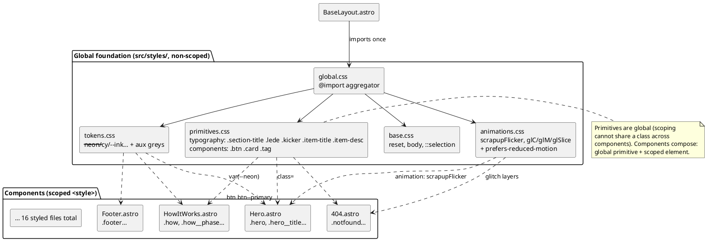
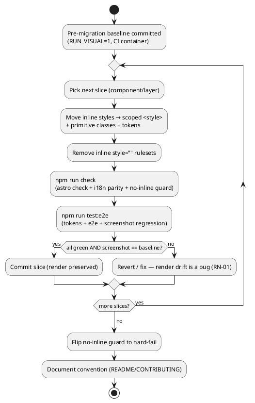

# Technical Plan: Styling Architecture Migration

> Phase 2 of Spec-Driven Development — the **how**. Implements `spec.md` (approved).
> Authored in English per the project artifact-language rule (`CLAUDE.md`).
> **Prerequisite:** `spec.md` approved. Scope: `scrapup-site` (personal static Astro project —
> no backend/Sami architecture; plain CSS, no new dependency).

## 1. Architecture Overview

- **Main decision:** move all presentational styling from inline `style="…"` attributes (and the
  ~25 frontmatter style strings) into **Astro component-scoped `<style>` blocks** using **plain CSS**,
  backed by a **global style foundation** (design tokens, reset, animations, and a small set of
  **shared primitive classes**). Astro automatically namespaces scoped class names per component, so
  collisions are impossible and a **methodology like BEM is not needed for isolation** — we keep a
  BEM-*style* naming convention only for **readability and grep-ability**, not for scoping.
- **Approach:** a **layered, behavior-preserving migration**:
  1. **Lock the safety net first** — capture a pre-migration screenshot baseline (the layout guard)
     and add a zero-dependency "no inline style" guard, so every later step is verified.
  2. **Build the foundation** — split the global stylesheet into tokens/base/animations/primitives;
     promote the recurring grey/shade literals to **auxiliary tokens**; extract the duplicated
     patterns (`button`, `card`, `tag`, `section label`) into **global primitive classes**.
  3. **Migrate consumers** — convert each component's inline styles into a scoped `<style>` block +
     primitive classes, one verifiable slice at a time (inline and migrated styles coexist safely).
  4. **Seal** — flip the no-inline guard to hard-fail and document the convention.
- **Why scoped + plain CSS:** it is Astro's **native, idiomatic** model — zero new dependency, zero
  extra build step, styles **co-located** with the markup they dress, and isolation handled by the
  compiler. Native CSS nesting + custom properties cover the ergonomics that would otherwise pull in
  Sass. Shared primitives recover the one thing scoping cannot give (cross-component reuse) without a
  framework.
- **Repository affected:** `scrapup-site` (this repo). No change to routing, i18n, SEO, build, or
  deploy; the only `package.json` change is one **dev-only** guard script wired into `check` (no
  runtime/build-output dependency, honoring RN-03).

### 1.1 Technical Choices

| Concern                  | Choice                                                                                     | Note                                                                                             |
| ------------------------ | ----------------------------------------------------------------------------------------- | ------------------------------------------------------------------------------------------------ |
| Styling mechanism        | Astro component-scoped `<style>` + plain CSS (native nesting)                              | Idiomatic Astro; auto-namespaced; co-located                                                     |
| Shared patterns          | Global **primitive classes** — typography (`.section-title`, `.lede`, `.kicker`, `.item-title`, `.item-desc`) + components (`.btn`, `.card`, `.tag`) | The only cross-component reuse path under scoping; defined once, non-scoped (§3.3) |
| Naming convention        | BEM-*style* (`block`, `block__element`, `block--modifier`) per component; primitives global | Readability/grep, **not** isolation (scoping already isolates) — see §4.1                         |
| Design tokens            | CSS custom properties: 6 canonical (unchanged) + **auxiliary** greys/shades               | Source of truth for color; no duplicated hex literals (RN-06/07)                                 |
| Global sheet layout      | Split `tokens.css` / `base.css` / `animations.css` / `primitives.css`, aggregated by `global.css` | `BaseLayout` keeps importing one entry; import path stable for tests                       |
| Dynamic values           | None data-driven today; structural conditionals → `:not(:first-child)` / modifier classes | RN-02; a future dynamic value would use a `style="--x: …"` hook                                   |
| No-inline enforcement    | **Zero-dep Node guard** `scripts/no-inline-styles.mjs`, wired into `npm run check`         | Fails the build if a `style=` ruleset survives; honors RN-03 (no stylelint dependency)           |
| Layout parity guard      | Activate existing `tests/visual/layout.spec.ts` with a **committed pre-migration baseline**   | Today it is `test.skip` unless `RUN_VISUAL=1` and has **no baseline** — the key safety gap        |
| Token/behavior guards    | Existing `tests/visual/tokens.spec.ts` + `tests/e2e/*` (unchanged)                        | Deterministic computed-style + functional/SEO/a11y coverage already present                       |
| New dependency           | **None** at runtime or in build output                                                    | Only a dev guard script + activation of an existing test                                          |

## 2. Solution Diagrams

### 2.1 Styling Architecture (component view — target state)




### 2.2 Per-component Migration & Verification Loop




> Diagrams are PlantUML source; rendering to PNG under `docs/diagrams/` is a documentation task in
> `tasks.md` (mirrors the `landing-page/` convention), using the `expert-plantuml` skill.

## 3. Style System Model

### 3.1 Design Tokens

**Canonical palette — unchanged (source of truth: `brand/scrapup - Logo System.dc.html` F9, see
`landing-page/plan.md` §3.3).** Already in `src/styles/global.css`; moves verbatim into `tokens.css`.

| Token          | Hex       | Role                          |
| -------------- | --------- | ----------------------------- |
| `--neon`       | `#FF7A33` | Accent on dark (CTAs, "up")   |
| `--neon-light` | `#E8641F` | Accent on light/paper         |
| `--cy`         | `#35E6E0` | Secondary accent (labels)     |
| `--ink`        | `#0A0D15` | Primary background            |
| `--paper`      | `#F2F0EA` | Light/inverse background      |
| `--light-ink`  | `#ECEEF4` | Foreground text on ink        |

**Auxiliary tokens — new (D3).** The exact inventory below comes from grepping every hex literal in
`src/` (counts are real occurrences). Each distinct repeated literal becomes a **role-named** token so
no hex is duplicated across components (RN-06/07). The foreground greys form a deliberate
brightest→quietest text scale on `--ink`. **Token values are byte-identical to today's literals
(parity, RN-01) — only the spelling changes.**

Foreground text scale (on `--ink`):

| Token           | Hex       | Uses | Role (verified per occurrence)                                  |
| --------------- | --------- | ---- | -------------------------------------------------------------- |
| `--text-strong` | `#F2F3F8` | 11   | Section headlines / hero title / 404 title (brightest)         |
| `--light-ink` *(existing)* | `#ECEEF4` | 14 | Card/step titles, subheads, wordmark, switcher links        |
| `--text-soft`   | `#C7CCD8` | 5    | `HowItWorks` lede, list items, secondary mono labels           |
| `--text-muted`  | `#AEB4C2` | 10   | Standard lede / body paragraphs                                |
| `--text-footer` | `#9AA0B0` | 1    | Footer base text                                               |
| `--text-faint`  | `#8A90A0` | 9    | Small card/step descriptions                                  |
| `--text-dim`    | `#7E8597` | 4    | Mono kickers / section labels                                 |
| `--text-quiet`  | `#5A6172` | 3    | Footer fine print (MIT, domain, author)                       |

Backgrounds & decorative solids:

| Token              | Hex       | Uses | Role                                                        |
| ------------------ | --------- | ---- | ---------------------------------------------------------- |
| `--ink-deep`       | `#07090E` | 1    | Deep footer background                                      |
| `--glitch-magenta` | `#FF3DA6` | 1    | 404 glitch layer (`glM`). The three 404 glitch layers are: `glC`→`var(--cy)`, `glM`→`--glitch-magenta`, `glSlice`→`var(--neon)` |

**Canonical tokens written as literals (fix in place, no new token):** `#ECEEF4`→`var(--light-ink)`
(14×), `#0A0D15`→`var(--ink)` (CTA text-on-neon, 3×), and stray `#FF7A33`/`#E8641F`/`#35E6E0`/`#F2F0EA`
→ their canonical `var(--…)`. After migration **no canonical color appears as a hex literal**.

### 3.1.1 Translucency strategy (rgba / color-mix)

The prototype carries ~30 distinct `rgba()` values. Detokenize **parity-exactly**, by origin:

| Origin                         | Today (examples)                                  | Target                                                                 |
| ------------------------------ | ------------------------------------------------- | ---------------------------------------------------------------------- |
| Brand cyan alpha               | `rgba(53,230,224,.5)` `…,.4` `…,.12` …            | `color-mix(in srgb, var(--cy) <pct>%, transparent)` (exact equivalent) |
| Brand neon alpha               | already `color-mix(... var(--neon) N% ...)`       | keep as-is                                                             |
| Recurring non-brand RGB bases  | `rgba(20,26,40,α)` `rgba(14,18,28,α)` `rgba(120,190,210,α)` `rgba(190,200,220,α)` `rgba(179,136,255,α)` | **RGB-triplet tokens** consumed inside `rgba()` — see below |
| Black shadows                  | `rgba(0,0,0,.42)` …                               | keep as literal (shadow convention; no token warranted)                |
| True one-offs (`16,20,30` `12,15,23` `184,190,204`) | single use                       | keep as a **documented literal** in the component's scoped block        |
| Keyframe-internal literals (`#fff`, `rgba(184,190,204,.34)` inside `glC`/`glM`) | in `@keyframes` | **move verbatim** into `animations.css`; not tokenized (not a component style; RN-07 targets component CSS) |

RGB-triplet tokens (enable `rgba(var(--x), α)` so the **alpha stays per-use** but the base is named):

| Token         | RGB triplet     | Origin / use                                              |
| ------------- | --------------- | -------------------------------------------------------- |
| `--panel-hi`  | `20,26,40`      | `HowItWorks` panel gradient (top), glass cards           |
| `--panel-lo`  | `14,18,28`      | panel gradient (bottom)                                  |
| `--hairline`  | `120,190,210`   | card borders, switcher divider, footer top border        |
| `--mark`      | `190,200,220`   | registration marks / scanlines (shell, `aria-hidden`)    |
| `--violet`    | `179,136,255`   | ambient corner glow (`Landing` shell, 404)               |

> Parity note: `rgba(53,230,224,.5)` and `color-mix(in srgb, var(--cy) 50%, transparent)` resolve to
> the same pixels; `rgba(var(--panel-hi), .82)` expands to `rgba(20,26,40,.82)` verbatim. The
> screenshot regression (§4.3) is the backstop for any rounding surprise.

### 3.2 Global Stylesheet Layout

```
src/styles/
  global.css        # @import './tokens.css' './base.css' './animations.css' './primitives.css'  (single entry, unchanged import in BaseLayout)
  tokens.css        # :root { canonical + auxiliary custom properties }
  base.css          # box-sizing reset, html/body, ::selection, ::placeholder, font smoothing
  animations.css    # @keyframes scrapupFlicker, glC, glM, glSlice + prefers-reduced-motion block
  primitives.css    # typography: .section-title .lede .kicker(.--faint) .item-title .item-desc
                    # components: .btn(.--primary/.--ghost) .card(.--accent/.--edge) .tag(.--cyan/.--neon)
```

`BaseLayout.astro` continues to `import '../styles/global.css'` — the split is internal, so the
existing import and the token tests keep working unchanged.

### 3.3 Shared Primitives (catalog)

Derived from the **measured** repetition across sections (the `card`/`cta`/`tag`/`name`/`desc` strings
and the headline/lede blocks). Each primitive is a **global, non-scoped** class in `primitives.css`;
components add scoped `block__element` classes only for per-section deltas. The single biggest win is
`.section-title`: the exact same headline ruleset (`#F2F3F8` Space Grotesk 600,
`clamp(1.7rem,3.2vw,2.6rem)/1.08/-.02em`) is duplicated across **8** sections today.

**Typography primitives**

| Primitive        | Captures (exact)                                                                 | Reused by | Per-section delta |
| ---------------- | -------------------------------------------------------------------------------- | --------- | ----------------- |
| `.section-title` | `--text-strong` Space Grotesk 600 `clamp(1.7rem,3.2vw,2.6rem)/1.08/-.02em`        | Problem, Answer, Pillars, WhyDifferent, Status, OpenExtensible, BuiltOnUP (≈8) | Hero/HowItWorks/FinalCta/404 keep **scoped** titles (different size/shadow) — documented, not forced into a modifier |
| `.lede`          | `--text-muted` `1.05rem/1.6`, `max-width:640px`                                   | Problem, Answer, WhyDifferent, FinalCta, BuiltOnUP | Hero lede is scoped (different size) |
| `.kicker`        | IBM Plex Mono, `font-size:11–12px`, `letter-spacing`                              | TopBar, Hero, Status, WhyDifferent, HowItWorks | color via modifier (`--text-dim` default; `.kicker--faint` = `--text-faint`) |
| `.item-title`    | `--light-ink` Space Grotesk 600 (card/step title, default size)                  | Problem, Answer, Pillars, TwoRoles, HowItWorks, OpenExtensible | size override scoped where it differs |
| `.item-desc`     | `--text-faint` small `line-height:1.45–1.5`                                       | Problem, Answer, Pillars, TwoRoles, HowItWorks, OpenExtensible | margin-top override scoped |

**Component primitives**

| Primitive | Captures                                                                                   | Modifiers                                              |
| --------- | ------------------------------------------------------------------------------------------ | ----------------------------------------------------- |
| `.btn`    | CTA anchor base: inline-flex, gap, padding, mono 13px 600, `letter-spacing:.06em`, no-underline | `.btn--primary` (`background:var(--neon)`, `color:var(--ink)`, neon glow); `.btn--ghost` (docs/secondary) |
| `.card`   | Glass panel: dark gradient (`--panel-hi`/`--panel-lo`), `--hairline` border, padding       | `.card--accent` (neon left border + glow); `.card--edge` (WhyDifferent highlighted, neon border) |
| `.tag`    | Mono chip: small padding, border, background tint                                          | `.tag--cyan` (BuiltOnUP, `--cy` tint); `.tag--neon` (OpenExtensible, `--neon` tint) |

Where a "shared" pattern has a genuine per-section difference (RN-04 edge case), the base primitive
carries the common rules and the component's scoped `block__element--modifier` carries the delta —
never force-fit divergent styles into one class.

### 3.4 Migration target set (16 files)

`Landing.astro` (shell: ambient glow/scanlines/marks), the 13 `sections/*.astro`,
`LanguageSwitcher.astro`, and `404.astro`. `BaseLayout.astro`, `Seo.astro`, and the three
page-composition files (`index`, `pt/index`, `ja/index`) carry no inline styles and are untouched
(except `BaseLayout` keeping its single `global.css` import). Total `.astro`: 21.

### 3.5 Per-component Inventory (drives the backlog)

Real inline counts and the primitives/tokens each component will consume. This table is the
authority for the migration TFs in `tasks.md`.

| Component (`src/`)                 | Inline | Primitives consumed                          | Tokens / notes                                           |
| ---------------------------------- | ------ | -------------------------------------------- | -------------------------------------------------------- |
| `components/Landing.astro`         | 8      | — (shell)                                    | `--violet`/`--cy` ambient glow, `--mark` scanlines/marks; `aria-hidden` decorative layers |
| `components/sections/TopBar.astro` | 9      | `.kicker`, `.item-title`(wordmark)           | `--light-ink`, `--text-dim`; neon flicker (`scrapupFlicker`) |
| `components/sections/Hero.astro`   | 12     | `.btn--primary`, `.btn--ghost`, `.kicker`    | scoped title (`--text-strong`, large), scoped lede; neon badge/glow |
| `components/sections/Problem.astro`| 6      | `.section-title`, `.lede`, `.card`, `.item-title`, `.item-desc` | stat value `--neon` + glow |
| `components/sections/Answer.astro` | 8      | `.section-title`, `.lede`, `.item-title`, `.item-desc` | step number `--neon` |
| `components/sections/HowItWorks.astro` | 19 | `.kicker`, `.item-title`, `.item-desc`       | scoped title (700 + cyan shadow), milestone panel (`--panel-hi/-lo`, `--hairline`), phase `--current` modifier, `--text-soft` |
| `components/sections/TwoRoles.astro`| 2     | `.card`, `.item-title`, `.item-desc`         | `.card--accent` left border; `--text-soft` kicker |
| `components/sections/Pillars.astro`| 4      | `.section-title`, `.card`, `.item-title`, `.item-desc` | pillar code `--neon` |
| `components/sections/WhyDifferent.astro`| 9 | `.section-title`, `.lede`, `.card--edge`, `.kicker`, `.item-desc` | floor (dashed) vs edge (neon); `--text-dim`/`--text-strong` |
| `components/sections/BuiltOnUP.astro`| 6    | `.section-title`, `.lede`, `.tag--cyan`      | `--text-soft`/`--text-faint`; cyan chips |
| `components/sections/OpenExtensible.astro`| 6 | `.section-title`, `.item-title`, `.item-desc`, `.tag--neon` | neon chips |
| `components/sections/Status.astro` | 10     | `.section-title`, `.kicker`, `.card`         | shipped vs roadmap; `--text-soft`/`--text-faint`/`--text-dim` |
| `components/sections/FinalCta.astro`| 14    | `.section-title`(scoped size), `.lede`, `.card--accent`, `.btn--primary`, `.btn--ghost`, `.item-title` | CTA card |
| `components/sections/Footer.astro` | 8      | — (footer-specific)                          | `--ink-deep` bg, `--hairline` top border, `--text-footer`/`--text-quiet`, wordmark `--light-ink`/`--neon` |
| `components/LanguageSwitcher.astro`| 2      | — (nav)                                       | `--light-ink`, `--hairline` divider (`:not(:first-child)` replaces `${i>0}`), neon active underline |
| `pages/404.astro`                  | 25     | `.btn--primary`, `.btn--ghost`, `.kicker`    | scoped glitch title (`glC`/`glM`, `--glitch-magenta`), `--text-strong`/`--text-muted`, ambient glow |

> `BaseLayout.astro`, `Seo.astro`, `pages/index.astro`, `pages/pt/index.astro`, `pages/ja/index.astro`
> carry **no** inline styles — untouched (BaseLayout keeps its single `global.css` import).

## 4. Conventions & Guards (contracts)

### 4.1 Class-naming convention

| Element            | Convention                                  | Example                                   |
| ------------------ | ------------------------------------------- | ----------------------------------------- |
| Component root     | `block` = component name in kebab-case      | `.hero`, `.how-it-works`, `.two-roles`    |
| Component element  | `block__element`                            | `.hero__title`, `.how-it-works__phase`    |
| Component modifier | `block__element--modifier` / `block--mod`   | `.how-it-works__phase--current`           |
| Global primitive   | flat primitive name (non-scoped)            | `.btn`, `.card`, `.tag`, `.section-title`, `.kicker` |
| Primitive modifier | `primitive--modifier`                       | `.btn--primary`, `.card--accent`          |

Rationale: scoping already guarantees uniqueness, so the `block__` prefix is **documentation**, not
collision-avoidance — it keeps a scoped rule self-describing and greppable. Primitives stay flat
because they are global and intentionally shared.

### 4.2 No-inline-style guard (`scripts/no-inline-styles.mjs`)

| Property | Value                                                                                                       |
| -------- | ----------------------------------------------------------------------------------------------------------- |
| Trigger  | `npm run check` (after `astro check` + i18n parity)                                                          |
| Scans    | All `src/**/*.astro`                                                                                         |
| Fails on | Any `style="…"` / `style={…}` whose declarations include a **standard CSS property** (a `prop:value` where the key does not start with `--`) |
| Allows   | `style="…"` where **every** declaration key starts with `--` (custom-property hooks only); documented; none expected at completion |
| Output   | Non-zero exit listing file:line of each offending `style=` (mirrors the i18n-parity script's UX)             |
| Rollout  | **Warn-only** while migrating (reports count), **hard-fail** after the last slice (sealing step)             |

### 4.3 Parity-test contract

| Guard                          | File                          | Asserts                                                                 |
| ------------------------------ | ----------------------------- | ---------------------------------------------------------------------- |
| Token / computed-style (exists) | `tests/visual/tokens.spec.ts` | Canonical palette resolves, `body` = `--ink`, fonts, CTA accent        |
| Layout regression (**activate**) | `tests/visual/layout.spec.ts` | Full-page screenshot per route == committed baseline (`animations:'disabled'`, masks) |
| Functional/SEO/a11y (exists)   | `tests/e2e/*`                 | Routes, detection, 404, links, SEO, axe-core                           |

**Baseline procedure (D1):** generate with `RUN_VISUAL=1 npm run test:e2e:update` on the official
Playwright container (per `CONTRIBUTING`), from the **pre-migration** code, and commit the PNGs under
`tests/visual/`. Every migration slice must keep these green; a diff is a render-drift bug (RN-01).

> **Automated-guard blind spots (must be covered manually).** The screenshot suite runs with
> `animations:'disabled'` + `reducedMotion:'reduce'` and **masks `[aria-hidden="true"]`**. Therefore
> (a) the CSS **animations** (`scrapupFlicker`, `glC`/`glM`/`glSlice`) and (b) the `Landing` shell
> **decorative layers** (glow/scanlines/registration marks) are **not** pixel-guarded. They are
> protected only by moving the rules **verbatim** (tokens-only spelling change) plus a **manual visual
> check** with animations on — see TF-58-04, TF-60-03 and the final check TF-61-04.

## 5. Migration Safety, Resilience & Error Handling

### 5.1 Safety Matrix

| Risk                          | Failure mode                                  | Strategy                                                                       | Impact if controlled |
| ----------------------------- | --------------------------------------------- | ----------------------------------------------------------------------------- | -------------------- |
| Cascade/specificity drift     | A migrated rule renders differently           | Screenshot regression vs. committed baseline catches it; revert slice         | None (caught pre-merge) |
| Color drift                   | Token mis-applied                             | `tokens.spec.ts` computed-style asserts                                       | None                 |
| Residual inline style         | A `style=` survives                           | `no-inline-styles.mjs` guard in `check`                                       | None                 |
| Shared primitive over-merge   | Forcing divergent styles into one class       | Base primitive + scoped modifier (§3.3); per-occurrence review                | Local, reversible    |
| Animation regression          | Flicker/glitch lost or `prefers-reduced-motion` broken | **Not covered by the screenshot suite** (it runs `animations:'disabled'` + `reducedMotion:'reduce'`). Animations move **verbatim** into `animations.css` (no edit) and the consuming class is unchanged; residual risk is closed by a **manual visual check** (animations on) in TF-58-04/TF-60-03 and the final check (TF-61-04). | Low — verbatim move + manual check |
| Masked decorative regions     | Drift in `Landing` shell glow/scanlines/marks | **Blind spot:** the screenshot `mask`s `[aria-hidden="true"]`, so these layers are not pixel-guarded. Mitigation: move declarations verbatim (tokens only), keep `aria-hidden`, **manual visual check** in TF-58-04; optional computed-style assert of the decorative colors. | Low — verbatim move + manual check |
| Partial-migration breakage    | Half-migrated component looks wrong           | Inline + scoped coexist (RN-11); slice is atomic and independently verified   | None                 |

### 5.2 Rollback

Each slice is an atomic, independently revertible change (one component or one foundation file).
Because the baseline is captured up front, reverting a slice restores a verified-green state. No
cross-slice state is shared.

### 5.3 SLAs & footprint

Zero new runtime/build dependency; scoped CSS is extracted/concatenated at build time (Astro), so the
shipped CSS stays comparable in size (deduplicated primitives may **reduce** it). Zero client JS added
(RN-08). SEO/a11y/perf SLAs unaffected (RN-09).

## 6. Developer Experience

- **Editing model after migration:** colors/values in `src/styles/tokens.css`; shared look in
  `src/styles/primitives.css`; component-specific look in that component's scoped `<style>`. A visual
  change is a single named rule in a single place.
- `package.json`: `check` chains the new guard; no new scripts otherwise. `test:e2e:update` (exists)
  regenerates baselines (CI-container only).
- `CONTRIBUTING.md` / `README.md` gain a short **"Styling"** section: scoped CSS + BEM-style names +
  tokens/primitives + the no-inline rule + how baselines are regenerated.

## 7. Justification & Trade-offs

| Decision                                   | Rejected alternative              | Justification                                                                                              |
| ------------------------------------------ | --------------------------------- | --------------------------------------------------------------------------------------------------------- |
| Astro scoped `<style>` + plain CSS         | Global BEM stylesheet (original ask) | Scoping already isolates; co-location is idiomatic Astro; no global-namespace burden                   |
| Plain CSS (native nesting)                 | Sass/SCSS                         | Architect decision (RN-03): nesting + custom properties suffice; avoids a build dependency                |
| Global primitive classes                   | Repeating styles per component / Astro `define:vars` | The one reuse path scoping lacks; removes the duplicated `card/cta/tag` strings              |
| BEM-style names (no scoping reliance)      | Hashed/flat scoped names only     | Readability + grep-ability; the `block__` prefix documents intent                                         |
| Tokenize auxiliary greys (D3)              | Keep grey literals (§3.3 note)    | The migration's whole point is organization; literals duplicated across files defeat it (RN-06/07)        |
| Zero-dep no-inline guard (D2)              | stylelint                         | Enforces RN-02 mechanically without adding a dependency (RN-03); mirrors the existing i18n-parity guard   |
| Baseline-first, then migrate (D1)          | Migrate then eyeball              | Token asserts don't catch layout drift; an up-front baseline turns RN-01 into a mechanical check          |
| Layered slicing (foundation → consumers)   | Big-bang rewrite                  | Maximizes primitive reuse before consumers migrate; each slice independently verifiable (RN-11)           |

## 8. Resolved Decisions

1. **D1 — Pre-migration screenshot baseline:** yes. Generated on the CI container, committed before
   any consumer migration; activates the layout parity guard.
2. **D2 — No-inline enforcement:** zero-dependency Node guard (`scripts/no-inline-styles.mjs`) wired
   into `npm run check`; warn-only during migration, hard-fail at sealing.
3. **D3 — Tokenize greys/shades:** yes; promoted to auxiliary tokens in `tokens.css` (§3.1).
4. **Styling mechanism:** Astro component-scoped `<style>` + plain CSS; shared primitives global.
5. **Naming:** BEM-style (`block__element--modifier`) per component; flat primitive names global.
